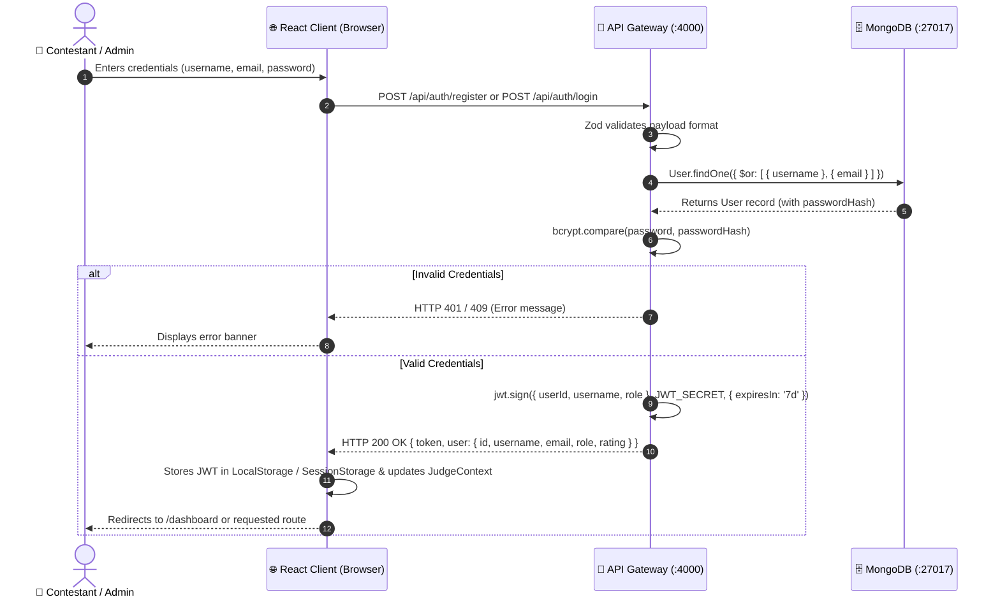
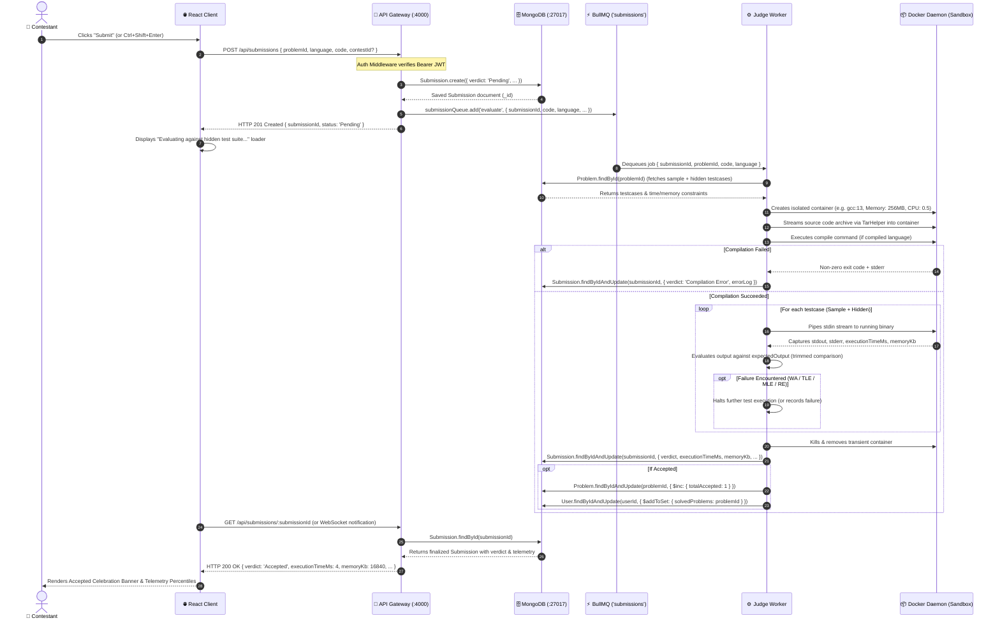
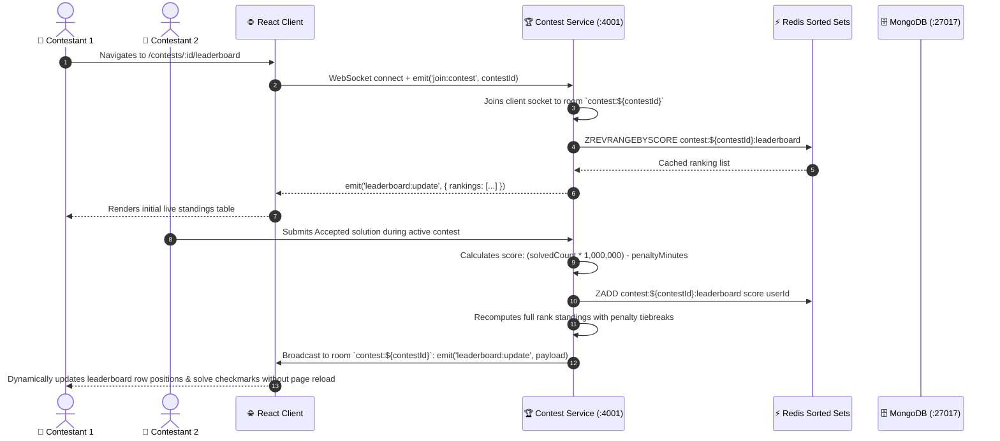
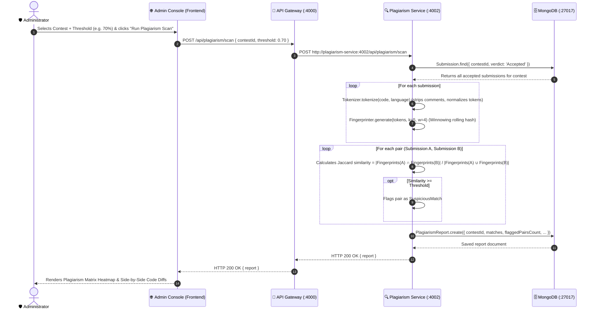
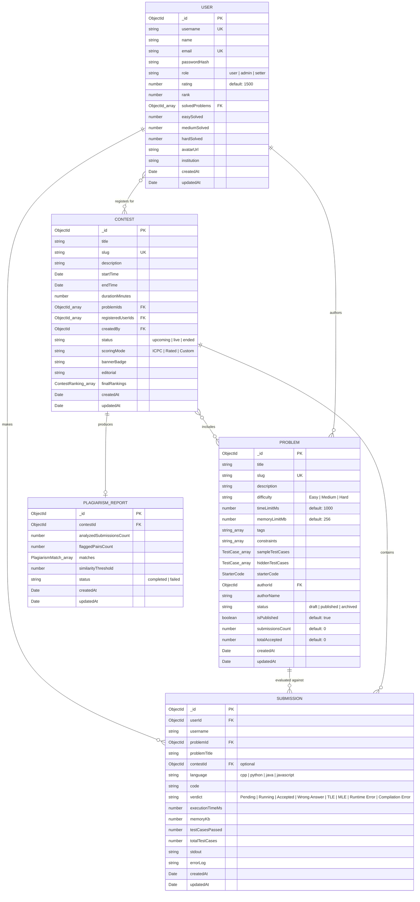
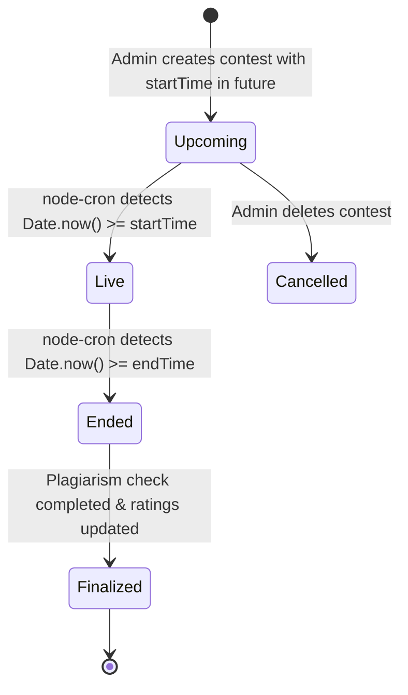

# AlgoFlow

AlgoFlow is an enterprise-grade, distributed competitive programming and online code execution platform built with microservices architecture. Designed to emulate the core capabilities of platforms like LeetCode and Codeforces, AlgoFlow executes untrusted polyglot code inside hardened Docker sandbox containers, manages high-throughput asynchronous judging pipelines using Redis and BullMQ, synchronizes real-time live contest scoreboards over WebSockets, and performs structural AST-based plagiarism detection across tournament submissions.

[](LICENSE)
[](https://nodejs.org)
[](https://www.typescriptlang.org/)
[](https://react.dev/)
[](https://vitejs.dev/)
[](https://www.docker.com/)
[](CONTRIBUTING.md)

**Distributed asynchronous code evaluation, isolated container sandboxing, real-time tournament leaderboards, and algorithmic plagiarism detection for modern engineers.**

---

### Platform Preview

```
+----------------------------------------------------------------------------------------------------+
|  AlgoFlow  |  [Problems]  [Contests]  [Leaderboard]  [Submissions]  [Admin]  |  [Ctrl+K]  (Alex Chen) |
+----------------------------------------------------------------------------------------------------+
|  Description (C++ / 1000ms / 256MB)           |  Monaco Editor Canvas [ C++ (GCC 13) ]             |
|  -------------------------------------------- |  ------------------------------------------------- |
|  1. Two Sum (Easy)                            |  1  #include <vector>                              |
|  Given an array of integers nums and an       |  2  #include <unordered_map>                       |
|  integer target, return indices of the two    |  3  using namespace std;                           |
|  numbers such that they add up to target.     |  4                                                 |
|                                               |  5  class Solution {                               |
|  Constraints:                                 |  6  public:                                        |
|  * 2 <= nums.length <= 10^4                   |  7      vector<int> twoSum(vector<int>& nums,      |
|  * -10^9 <= nums[i] <= 10^9                   |  8                         int target) {           |
|  * -10^9 <= target <= 10^9                    |  9          unordered_map<int, int> seen;          |
|                                               |  10         for (int i = 0; i < nums.size(); ++i){ |
|  [Test Case 1] [Test Case 2] [+ Custom Input] |  11             int comp = target - nums[i];       |
|  Input: nums = [2, 7, 11, 15], target = 9     |  12             if (seen.count(comp))              |
|  Expected Output: [0, 1]                      |  13                 return {seen[comp], i};        |
|  Actual Output:   [0, 1]  (PASSED)            |  14             seen[nums[i]] = i;                 |
|                                               |  15         }                                      |
|  Telemetry: CPU: 2.1ms | Memory: 14.8MB       |  16         return {};                             |
|  Beats 98.4% speed | Beats 92.1% memory       |  17     }                                          |
|                                               |  18 };                                             |
+----------------------------------------------------------------------------------------------------+
|  [Terminal Console]  [Visualizer (V)]  [Stress Tester (S)]         [ Run (Ctrl+Enter) ] [ Submit ] |
+----------------------------------------------------------------------------------------------------+
```

---

## Table of Contents

- [1. Header & Badges](#algoflow)
- [2. Table of Contents](#table-of-contents)
- [3. Feature Overview](#3-feature-overview)
- [4. Architecture Overview](#4-architecture-overview)
  - [4.1 System Architecture Diagram](#41--system-architecture-diagram)
  - [4.2 Service Responsibility Table](#42--service-responsibility-table)
  - [4.3 Microservice Communication Protocols](#43--microservice-communication-protocols)
  - [4.4 End-to-End Data Flow Sequence Diagrams](#44--end-to-end-data-flow-sequence-diagrams)
- [5. Tech Stack](#5-tech-stack)
- [6. Database Schema & ER Diagram](#6-database-schema--er-diagram)
  - [6.1 Entity Relationship (ER) Diagram](#61--entity-relationship-er-diagram)
  - [6.2 MongoDB Collections Reference](#62--mongodb-collections-reference)
- [7. Complete API Reference](#7-complete-api-reference)
  - [7.1 Authentication Endpoints](#71--authentication-endpoints)
  - [7.2 Problem Catalog Endpoints](#72--problem-catalog-endpoints)
  - [7.3 Submission & Code Execution Endpoints](#73--submission--code-execution-endpoints)
  - [7.4 Contest & Tournament Endpoints](#74--contest--tournament-endpoints)
  - [7.5 Leaderboard Endpoints](#75--leaderboard-endpoints)
  - [7.6 Admin Operations Endpoints](#76--admin-operations-endpoints)
  - [7.7 Plagiarism Service Endpoints](#77--plagiarism-service-endpoints)
- [8. WebSocket Event Reference](#8-websocket-event-reference)
- [9. Judge Engine Deep Dive](#9-judge-engine-deep-dive)
  - [9.1 Supported Languages & Toolchains](#91--supported-languages--toolchains)
  - [9.2 Submission Lifecycle Walkthrough](#92--submission-lifecycle-walkthrough)
  - [9.3 Docker Sandbox Security Model](#93--docker-sandbox-security-model)
  - [9.4 Verdict Types & Determination Logic](#94--verdict-types--determination-logic)
  - [9.5 Test Case Execution & Comparison Model](#95--test-case-execution--comparison-model)
- [10. Contest System](#10-contest-system)
  - [10.1 Contest Lifecycle State Machine](#101--contest-lifecycle-state-machine)
  - [10.2 ICPC Scoring & Penalty Algorithm](#102--icpc-scoring--penalty-algorithm)
  - [10.3 Redis Sorted Set Leaderboard Architecture](#103--redis-sorted-set-leaderboard-architecture)
  - [10.4 Real-Time WebSocket Updates & Rooms](#104--real-time-websocket-updates--rooms)
- [11. Frontend Architecture](#11-frontend-architecture)
  - [11.1 Component Tree Diagram](#111--component-tree-diagram)
  - [11.2 State Management & JudgeContext](#112--state-management--judgecontext)
  - [11.3 Routing Table & Protected Routes](#113--routing-table--protected-routes)
  - [11.4 Keyboard Shortcuts Reference](#114--keyboard-shortcuts-reference)
  - [11.5 Design System & CSS Design Tokens](#115--design-system--css-design-tokens)
- [12. Environment Variables Reference](#12-environment-variables-reference)
- [13. Getting Started](#13-getting-started)
  - [13.1 Prerequisites](#131--prerequisites)
  - [13.2 Option A: Standalone Frontend (Quickest)](#132--option-a-standalone-frontend-quickest)
  - [13.3 Option B: Full Stack with Docker Compose](#133--option-b-full-stack-with-docker-compose)
  - [13.4 Option C: Windows Native Setup (start.bat / start.ps1)](#134--option-c-windows-native-setup-startbat--startps1)
  - [13.5 Database Seeding & Verification](#135--database-seeding--verification)
- [14. Development Guide](#14-development-guide)
  - [14.1 Full Annotated Directory Tree](#141--full-annotated-directory-tree)
  - [14.2 Available Scripts](#142--available-scripts)
  - [14.3 Adding a New Language to the Judge](#143--adding-a-new-language-to-the-judge)
  - [14.4 Adding a Problem via Problem Setter Studio](#144--adding-a-problem-via-problem-setter-studio)
  - [14.5 Adding a New Backend REST Endpoint](#145--adding-a-new-backend-rest-endpoint)
  - [14.6 Automated Testing Status](#146--automated-testing-status)
- [15. Deployment Guide](#15-deployment-guide)
  - [15.1 Deploying Frontend to Vercel](#151--deploying-frontend-to-vercel)
  - [15.2 Deploying Frontend to Netlify](#152--deploying-frontend-to-netlify)
  - [15.3 Deploying Backend Services](#153--deploying-backend-services)
  - [15.4 Production Database Configuration (MongoDB Atlas & Redis Cloud)](#154--production-database-configuration-mongodb-atlas--redis-cloud)
  - [15.5 Production Docker Compose Deployment](#155--production-docker-compose-deployment)
- [16. User Guide](#16-user-guide)
  - [16.1 Registration & Authentication](#161--registration--authentication)
  - [16.2 Navigating the Problem Catalog](#162--navigating-the-problem-catalog)
  - [16.3 Problem Workspace Execution & Submission](#163--problem-workspace-execution--submission)
  - [16.4 Interactive Algorithm Visualizer](#164--interactive-algorithm-visualizer)
  - [16.5 Dual-Engine Stress Tester](#165--dual-engine-stress-tester)
  - [16.6 Competing in Contests & Reading Live Standings](#166--competing-in-contests--reading-live-standings)
  - [16.7 Command Palette (Ctrl+K)](#167--command-palette-ctrlk)
  - [16.8 User Profile & Rating Analytics](#168--user-profile--rating-analytics)
  - [16.9 Problem Setter Studio & Admin Operations](#169--problem-setter-studio--admin-operations)
- [17. Plagiarism Detection](#17-plagiarism-detection)
  - [17.1 AST Tokenization & Winnowing Fingerprinting](#171--ast-tokenization--winnowing-fingerprinting)
  - [17.2 Triggering Plagiarism Scans](#172--triggering-plagiarism-scans)
  - [17.3 Heatmap Matrix & Code Pair Diffs](#173--heatmap-matrix--code-pair-diffs)
- [18. Troubleshooting](#18-troubleshooting)
- [19. Performance & Scalability Notes](#19-performance--scalability-notes)
- [20. Security Considerations](#20-security-considerations)
- [21. Contributing](#21-contributing)
- [22. Academic Project Background](#22-academic-project-background)
- [23. License](#23-license)
- [24. Acknowledgements](#24-acknowledgements)

---

## 3. Feature Overview

| Category | Feature | Description | Status |
| :--- | :--- | :--- | :--- |
| **Code Editor** | **Monaco Code Editor** | Syntax-highlighted VS Code engine with dark/light themes, automatic tab sizing, font size adjustments (12-14px), and line highlighting. | `✅ Implemented` |
| **Code Editor** | **Polyglot Starter Code** | Pre-populated method templates and class boilerplate for C++20, Python 3.12, Java 21, and JavaScript ES2024. | `✅ Implemented` |
| **Code Editor** | **Reset & Copy Actions** | Single-click starter template reset with modal confirmation dialog and clipboard copy with visual feedback. | `✅ Implemented` |
| **Code Editor** | **Fullscreen Workspace** | Focus mode expanding the code editor across the entire viewport. | `✅ Implemented` |
| **Judge Engine** | **Asynchronous Queue Pipeline** | Submissions enqueued to BullMQ on Redis with immediate task ID generation and worker pool processing. | `✅ Implemented` |
| **Judge Engine** | **Docker Sandbox Isolation** | Code executed in transient Docker containers with cgroup memory ceilings (256MB), CPU quotas (50%), no-new-privileges, and PID limits (50). | `✅ Implemented` |
| **Judge Engine** | **Host Execution Fallback** | Automatic fallback to local subprocess execution with tempfile containment when Docker daemon is offline. | `✅ Implemented` |
| **Judge Engine** | **Deterministic Verdicts** | Granular verdicts: `Accepted` (AC), `Wrong Answer` (WA), `Time Limit Exceeded` (TLE), `Memory Limit Exceeded` (MLE), `Runtime Error` (RE), and `Compilation Error` (CE). | `✅ Implemented` |
| **Judge Engine** | **Telemetry Benchmarking** | Precise microsecond CPU time measurement, memory profiling, and percentile distributions ("Faster than X%"). | `✅ Implemented` |
| **Judge Engine** | **Custom Test Runner** | Stdin runner evaluating arbitrary user input without submitting against the hidden test suite. | `✅ Implemented` |
| **Problem Catalog** | **Multi-Faceted Filtering** | Real-time search by title, difficulty level (`Easy`, `Medium`, `Hard`), topic tags, and solved status (`Solved`, `Attempted`, `Todo`). | `✅ Implemented` |
| **Problem Catalog** | **Pagination & Sorting** | Server-side pagination with acceptance rate and submission count calculations. | `✅ Implemented` |
| **Problem Catalog** | **Markdown Problem Spec** | Full markdown statement rendering with math constraints, example test cases, and memory/time limit indicators. | `✅ Implemented` |
| **Interactive Tools** | **Algorithm Visualizer** | Step-by-step graphical debugger for Array Traversal, Two Pointers, Sliding Window, Stack/Queue, and Binary Search. | `✅ Implemented` |
| **Interactive Tools** | **Dual-Engine Stress Tester** | Automated differential fuzzing runner executing a brute-force vs. optimized solution against randomized inputs. | `✅ Implemented` |
| **Contest System** | **Automated Lifecycle** | Time-based state machine transitions (`upcoming` → `live` → `ended`) evaluated continuously via node-cron. | `✅ Implemented` |
| **Contest System** | **ICPC Scoring Engine** | Leaderboard rankings computed from total problems solved and cumulative penalty minutes (20 min per WA). | `✅ Implemented` |
| **Contest System** | **Real-Time Standings** | WebSocket event broadcasting (`leaderboard:update`) pushing sub-second scoreboard diffs to connected contest rooms. | `✅ Implemented` |
| **Contest System** | **Contest Editorials** | Official Markdown solutions and complexity breakdowns authorable by admins and locked until contest conclusion. | `✅ Implemented` |
| **Plagiarism Engine** | **AST Tokenization** | Keyword, identifier, and operator tokenization stripping whitespace, formatting, and variable renames. | `✅ Implemented` |
| **Plagiarism Engine** | **Winnowing Fingerprinting** | N-gram rolling hash ($N=5$) with sliding window ($W=4$) producing minimal deterministic fingerprint sets. | `✅ Implemented` |
| **Plagiarism Engine** | **Heatmap Similarity Matrix** | Interactive UI displaying cross-user submission similarity percentages and side-by-side code diffs. | `✅ Implemented` |
| **User & Auth** | **JWT Authentication** | Stateless JWT authentication with Bearer tokens stored in LocalStorage or SessionStorage based on "Remember Me". | `✅ Implemented` |
| **User & Auth** | **Role-Based Access Control** | Three permission tiers (`user`, `setter`, `admin`) restricting contest management and problem authoring. | `✅ Implemented` |
| **User & Auth** | **User Profile Dashboard** | Solved problem counts by difficulty, rating badges, contest history ledger, and institutional metadata. | `✅ Implemented` |
| **Admin Operations** | **Problem Authoring Studio** | Full problem creation and editing interface supporting sample test cases, hidden evaluation cases, limits, and tags. | `✅ Implemented` |
| **Admin Operations** | **Tournament Management** | Contest scheduler allowing problem ordering, custom banner badges, time window configuration, and editorial publishing. | `✅ Implemented` |
| **Admin Operations** | **User Role Manager** | Live user search with inline permission role escalation (`user` ↔ `setter` ↔ `admin`). | `✅ Implemented` |
| **Admin Operations** | **System Health Telemetry** | Health check monitoring Redis connectivity, BullMQ queue depth, and failed job counters. | `✅ Implemented` |
| **Developer Experience** | **Command Palette (Ctrl+K)** | Instant keyboard-driven navigation across all problem statements, active contests, and administrative views. | `✅ Implemented` |
| **Developer Experience** | **Dual Run Modes** | Full Docker Compose orchestration for production environments and fast standalone dev scripts for local testing. | `✅ Implemented` |

---

## 4. Architecture Overview

AlgoFlow is architected as an event-driven microservices ecosystem designed for horizontal scalability, zero-trust containerized execution, and fault-tolerant asynchronous queue processing.

### 4.1 — System Architecture Diagram

```mermaid
graph TB
    subgraph ClientLayer["🌐 Client Layer (Port 5173 / 3000)"]
        Browser["React 19 SPA (Vite + Monaco Editor + Tailwind CSS)"]
    end

    subgraph IngressGateway["🚪 API Gateway (Port 4000)"]
        Gateway["Express 4 API Gateway & Router"]
        AuthMiddleware["JWT / RBAC Auth Middleware"]
        Validator["Zod Schema Validator"]
        SubQueue["BullMQ Submission Producer"]
    end

    subgraph QueueBroker["⚡ In-Memory Data Store & Message Broker (Port 6379)"]
        Redis["Redis 7 (Alpine)"]
        SubQueueStore["BullMQ Queue: 'submissions'"]
        ScoreboardCache["Redis Sorted Sets (Leaderboards)"]
        PubSub["Redis Pub/Sub Event Bus"]
        Redis --- SubQueueStore
        Redis --- ScoreboardCache
        Redis --- PubSub
    end

    subgraph DatabaseLayer["🗄️ Primary Document Store (Port 27017)"]
        MongoDB[("MongoDB 7 Database ('algoflow')")]
    end

    subgraph ExecutionWorkers["⚙️ Judge Worker Cluster (Scale: N)"]
        Worker1["Judge Worker Instance #1"]
        Worker2["Judge Worker Instance #2"]
        DockerEngine["Docker Engine Daemon (docker.sock)"]
        
        subgraph SandboxContainers["📦 Transient Docker Sandboxes (Network Disabled)"]
            CPPBox["gcc:13 Sandbox (/tmp tmpfs, 256MB RAM, 50% CPU)"]
            PyBox["python:3.12 Sandbox (/tmp tmpfs, 256MB RAM, 50% CPU)"]
            JavaBox["openjdk:21 Sandbox (/tmp tmpfs, 256MB RAM, 50% CPU)"]
            JSBox["node:20 Sandbox (/tmp tmpfs, 256MB RAM, 50% CPU)"]
        end
    end

    subgraph ContestCluster["🏆 Contest & Real-Time Service (Port 4001)"]
        ContestEngine["Contest Lifecycle Manager (node-cron)"]
        LeaderboardEngine["Leaderboard Score Calculator"]
        SocketServer["Socket.IO WebSocket Server (Port 4001)"]
    end

    subgraph PlagiarismCluster["🔍 Plagiarism Detection Service (Port 4002)"]
        PlagDetector["Plagiarism Engine (AST Tokenizer + Winnowing Fingerprinter)"]
    end

    %% Client Interactions
    Browser -->|"HTTP REST Requests (Bearer JWT)"| Gateway
    Browser <-->|"WebSocket Full-Duplex (Socket.IO)"| SocketServer

    %% Gateway Routing
    Gateway --> AuthMiddleware --> Validator
    Validator -->|"Enqueues Submission Job"| SubQueue
    SubQueue -->|"LPUSH / XADD"| SubQueueStore
    Gateway -->|"CRUD Operations (Mongoose)"| MongoDB
    Gateway -->|"HTTP Proxy (/api/plagiarism)"| PlagDetector

    %% Worker Processing
    Worker1 -->|"BPOP Jobs"| SubQueueStore
    Worker2 -->|"BPOP Jobs"| SubQueueStore
    Worker1 -->|"Spawns & Pipes Stdin"| DockerEngine
    Worker2 -->|"Spawns & Pipes Stdin"| DockerEngine
    DockerEngine --- CPPBox
    DockerEngine --- PyBox
    DockerEngine --- JavaBox
    DockerEngine --- JSBox
    Worker1 -->|"Updates Verdict & Telemetry"| MongoDB
    Worker2 -->|"Updates Verdict & Telemetry"| MongoDB
    Worker1 -->|"Emits 'submission:evaluated'"| PubSub
    Worker2 -->|"Emits 'submission:evaluated'"| PubSub

    %% Contest & Leaderboard Interactions
    PubSub -->|"Notifies on Evaluated Submission"| LeaderboardEngine
    LeaderboardEngine -->|"ZADD / ZREVRANGEBYSCORE"| ScoreboardCache
    LeaderboardEngine --> SocketServer
    ContestEngine -->|"Reads Problemsets & Timers"| MongoDB
    SocketServer -->|"Broadcasts 'leaderboard:update'"| Browser

    %% Plagiarism Processing
    PlagDetector -->|"Fetches Accepted Submissions"| MongoDB
    PlagDetector -->|"Persists Plagiarism Reports"| MongoDB
```



### 4.2 — Service Responsibility Table

| Service Name | Default Port | Primary Technology | Key Responsibilities |
| :--- | :--- | :--- | :--- |
| **Frontend Client** | `5173` (Dev)<br>`3000` (Prod) | React 19, TypeScript, Vite, Tailwind CSS, Monaco Editor | User interface, Monaco code editing, interactive visualizers, stress tester, console output runner, WebSocket real-time subscription. |
| **API Gateway** | `4000` | Node.js, Express, TypeScript, Zod, Mongoose, BullMQ | Public entry point, JWT authentication, user role verification, CRUD for problems/users/contests, submission job enqueuing, health telemetry. |
| **Judge Worker** | N/A (Worker) | Node.js, TypeScript, Dockerode, BullMQ, Tar-stream | BullMQ queue worker consuming submission jobs, isolated Docker container execution, stdin/stdout stream piping, timeout enforcement, verdict evaluation. |
| **Contest Service** | `4001` | Node.js, Express, Socket.IO, node-cron, Redis | Contest state transition scheduler (`upcoming` → `live` → `ended`), Redis sorted-set leaderboard computation, ICPC penalty calculation, WebSocket room broadcasting. |
| **Plagiarism Service** | `4002` | Node.js, Express, TypeScript, Mongoose | AST tokenization, Winnowing fingerprinting algorithm, Jaccard n-gram similarity scoring, pairwise submission comparison matrix generation. |
| **MongoDB Database** | `27017` | MongoDB 7.0 (Community Server) | Persistent document store for Users, Problems, Submissions, Contests, and Plagiarism Reports. |
| **Redis Store** | `6379` | Redis 7.0 (Alpine) | In-memory message broker for BullMQ submission queues, Pub/Sub event bus, and sorted sets for contest scoreboards. |

### 4.3 — Microservice Communication Protocols

1. **HTTP REST (`JSON`)**: Used for all client-to-gateway interactions, authentication, administrative CRUD, and internal gateway-to-plagiarism-service proxying.
2. **WebSocket (`Socket.IO 4.8`)**: Used for bidirectional real-time contest room events, participant join/leave signals, and live leaderboard diff pushes.
3. **BullMQ Queue (`Redis Stream / List`)**: Asynchronous, guaranteed-delivery job queue (`submissions`) linking API Gateway producers with Judge Worker consumers.
4. **Redis Pub/Sub**: Event bus decoupling the Judge Worker verdict completion from the Contest Service leaderboard recalculation.

---

### 4.4 — End-to-End Data Flow Sequence Diagrams

#### Flow 1: User Registration & Authentication Flow



#### Flow 2: Code Submission & Judging Lifecycle Flow



#### Flow 3: Contest Live Leaderboard Flow



#### Flow 4: Plagiarism Detection Scan Flow



---

## 5. Tech Stack

| Technology | Exact Version | Role in Architecture | Technical Rationale |
| :--- | :--- | :--- | :--- |
| **React** | `^19.0.0` | Frontend UI Framework | Modern component rendering, declarative state hooks, sub-millisecond DOM updates for fast-paced coding sessions. |
| **TypeScript** | `^5.7.2` | Core Language (Frontend & Backend) | End-to-end type safety, shared interfaces across microservices, compile-time error detection. |
| **Vite** | `^8.0.0` | Frontend Build Tool & Dev Server | Instant Hot Module Replacement (HMR), optimized tree-shaking, lightning-fast dev server initialization. |
| **Tailwind CSS** | `^3.4.17` | Design System & Styling | Utility-first CSS engine with dark mode tokens, fluid typography, and custom micro-animations. |
| **Monaco Editor React** | `^4.7.0` | Browser Code Editor Component | High-performance VS Code editor component in the browser, featuring syntax highlighting, code folding, and custom themes. |
| **Lucide React** | `^1.16.0` | UI Iconography | Crisp, lightweight, tree-shakeable SVG icon system matching the dark-carbon aesthetic. |
| **React Router DOM** | `^7.1.3` | Client-Side Routing | Declarative nested routing, dynamic parameter loading (`:slug`, `:id`), and auth route protection. |
| **Axios** | `^1.7.9` | HTTP Client | Promise-based REST client with automated request interceptors injecting JWT Bearer tokens. |
| **Socket.IO Client** | `^4.8.1` | Client WebSocket Client | Resilient full-duplex socket client handling auto-reconnection and room multiplexing. |
| **Node.js** | `>=18.0.0` | Backend Runtime Environment | Asynchronous non-blocking event loop ideal for microservice routing and stream processing. |
| **Express** | `^4.21.2` | Backend Web Framework | Robust, minimalist REST framework providing routing and middleware composition. |
| **MongoDB / Mongoose** | `^8.9.5` | Document Database & ODM | Schema-enforced document storage, compound index acceleration, and populated relations. |
| **Redis / IORedis** | `^5.4.2` | In-Memory Data Store & Queue Backend | Sub-millisecond latency for BullMQ job queue storage, Pub/Sub channels, and leaderboard sorted sets. |
| **BullMQ** | `^5.41.0` | Distributed Asynchronous Queue | Redis-backed background job queue with concurrency management, retry policies, and backoff limits. |
| **Dockerode** | `^4.0.2` | Docker Daemon SDK | Programmatic control over container lifecycle, memory/CPU limits, stdin/stdout stream multiplexing. |
| **Socket.IO Server** | `^4.8.1` | WebSocket Server Engine | Scalable WebSocket server supporting room-based event broadcasting and client heartbeats. |
| **JSONWebToken (JWT)** | `^9.0.2` | Authentication Token Protocol | Secure, stateless authentication with cryptographic signature verification. |
| **Bcryptjs** | `^2.4.3` | Password Hashing Function | Blowfish-based adaptive hashing algorithm with salt rounds protecting stored credentials. |
| **Zod** | `^3.24.1` | Runtime Schema Validation | Type-safe input validation for HTTP requests preventing malicious or malformed payloads. |
| **Node-Cron** | `^3.0.3` | Backend Task Scheduler | Precise cron scheduling for automated contest lifecycle transitions (`upcoming` → `live` → `ended`). |
| **Tar-Stream** | `^3.1.7` | In-Memory Archive Packer | Fast memory streaming of source code into Docker sandbox containers without disk I/O. |
| **CORS** | `^2.8.5` | Cross-Origin Middleware | Fine-grained HTTP access control allowing secure cross-port communication. |
| **PostCSS / Autoprefixer**| `^8.4.49` | CSS Processing | Automatic vendor prefix injection ensuring cross-browser styling consistency. |

---

## 6. Database Schema & ER Diagram

### 6.1 — Entity Relationship (ER) Diagram



---

### 6.2 — MongoDB Collections Reference

#### Collection: `users`
Stores user profile information, authentication credentials, competition ratings, and problem-solving history.

| Field | Type | Required | Default | Notes & Constraints |
| :--- | :--- | :--- | :--- | :--- |
| `_id` | `ObjectId` | Yes | Auto | Unique MongoDB Document Primary Key |
| `username` | `String` | Yes | None | Unique index, lowercase, trimmed, 3-30 chars |
| `name` | `String` | No | `""` | User's display full name |
| `email` | `String` | Yes | None | Unique index, lowercase, validated email format |
| `passwordHash` | `String` | Yes | None | Bcrypt hashed string (salt rounds = 10) |
| `role` | `String` | Yes | `'user'` | Enum: `['user', 'admin', 'setter']` |
| `rating` | `Number` | Yes | `1500` | Global competitive rating score |
| `rank` | `Number` | No | None | Calculated global platform standing |
| `solvedProblems`| `[ObjectId]` | Yes | `[]` | References `Problem` collection (`_id`) |
| `easySolved` | `Number` | Yes | `0` | Count of Easy difficulty problems solved |
| `mediumSolved` | `Number` | Yes | `0` | Count of Medium difficulty problems solved |
| `hardSolved` | `Number` | Yes | `0` | Count of Hard difficulty problems solved |
| `avatarUrl` | `String` | No | `""` | User avatar image URL |
| `institution` | `String` | No | `""` | University / College / Organization |
| `createdAt` | `Date` | Yes | Auto | Timestamp of record creation |
| `updatedAt` | `Date` | Yes | Auto | Timestamp of last record update |

- **Indexes:** `{ username: 1 }` (unique), `{ email: 1 }` (unique), `{ rating: -1 }`

---

#### Collection: `problems`
Stores the competitive programming problem catalog, constraints, test suites, and language starter templates.

| Field | Type | Required | Default | Notes & Constraints |
| :--- | :--- | :--- | :--- | :--- |
| `_id` | `ObjectId` | Yes | Auto | Unique Problem Document ID |
| `title` | `String` | Yes | None | Problem title (e.g., "Two Sum") |
| `slug` | `String` | Yes | Auto | URL slug (e.g., "two-sum"), unique index |
| `description` | `String` | Yes | None | Markdown statement describing the problem |
| `difficulty` | `String` | Yes | `'Medium'` | Enum: `['Easy', 'Medium', 'Hard']` |
| `timeLimitMs` | `Number` | Yes | `1000` | Execution timeout per testcase (100-10000ms) |
| `memoryLimitMb` | `Number` | Yes | `256` | RAM limit for sandbox container (64-2048MB) |
| `tags` | `[String]` | Yes | `[]` | Categorical topic tags (e.g., `["Array", "Hash Table"]`) |
| `constraints` | `[String]` | Yes | `[]` | Array of mathematical constraint strings |
| `sampleTestCases`| `[Object]` | Yes | `[]` | Array of `{ id, input, expectedOutput, explanation }` |
| `hiddenTestCases`| `[Object]` | Yes | `[]` | Hidden test cases for evaluation `{ input, expectedOutput }` |
| `starterCode` | `Object` | Yes | Boilerplate| Map containing `{ cpp, python, java, javascript }` starter code |
| `authorId` | `ObjectId` | No | None | References `User` (`_id`) |
| `authorName` | `String` | No | `'AlgoFlow'`| Display author handle |
| `status` | `String` | Yes | `'published'`| Enum: `['draft', 'published', 'archived']` |
| `isPublished` | `Boolean` | Yes | `true` | Publication visibility flag |
| `submissionsCount`|`Number` | Yes | `0` | Total submission attempts counter |
| `totalAccepted` | `Number` | Yes | `0` | Total accepted solutions counter |
| `createdAt` | `Date` | Yes | Auto | Timestamp of record creation |
| `updatedAt` | `Date` | Yes | Auto | Timestamp of last record update |

- **Indexes:** `{ slug: 1 }` (unique), `{ difficulty: 1 }`, `{ tags: 1 }`, `{ status: 1 }`

---

#### Collection: `submissions`
Maintains the immutable ledger of all code evaluations, execution verdicts, and performance benchmarks.

| Field | Type | Required | Default | Notes & Constraints |
| :--- | :--- | :--- | :--- | :--- |
| `_id` | `ObjectId` | Yes | Auto | Unique Submission ID |
| `userId` | `ObjectId` | Yes | None | References `User` collection |
| `username` | `String` | Yes | None | Denormalized user handle for fast query lookups |
| `problemId` | `ObjectId` | Yes | None | References `Problem` collection |
| `problemTitle` | `String` | Yes | None | Denormalized problem title |
| `contestId` | `ObjectId` | No | None | References `Contest` collection (if submitted in contest) |
| `language` | `String` | Yes | None | Enum: `['cpp', 'python', 'java', 'javascript']` |
| `code` | `String` | Yes | None | Exact source code submitted by user |
| `verdict` | `String` | Yes | `'Pending'` | Enum: `['Pending', 'Running', 'Accepted', 'Wrong Answer', 'Time Limit Exceeded', 'Memory Limit Exceeded', 'Runtime Error', 'Compilation Error']` |
| `executionTimeMs`| `Number` | Yes | `0` | Measured execution CPU time in milliseconds |
| `memoryKb` | `Number` | Yes | `0` | Measured peak memory consumption in kilobytes |
| `testCasesPassed`| `Number` | Yes | `0` | Number of test cases passed successfully |
| `totalTestCases` | `Number` | Yes | `0` | Total test cases evaluated in suite |
| `stdout` | `String` | No | `""` | Program standard output trace |
| `errorLog` | `String` | No | `""` | Compilation error or stack trace message |
| `createdAt` | `Date` | Yes | Auto | Submission timestamp |

- **Indexes:** `{ userId: 1, createdAt: -1 }`, `{ problemId: 1, createdAt: -1 }`, `{ contestId: 1 }`, `{ verdict: 1 }`

---

#### Collection: `contests`
Manages competitive tournaments, registration rosters, time windows, and editorial solutions.

| Field | Type | Required | Default | Notes & Constraints |
| :--- | :--- | :--- | :--- | :--- |
| `_id` | `ObjectId` | Yes | Auto | Unique Contest ID |
| `title` | `String` | Yes | None | Tournament title |
| `slug` | `String` | Yes | Auto | URL slug (e.g., `algo-grand-prix-1`), unique index |
| `description` | `String` | No | `""` | Contest description and rules (Markdown) |
| `startTime` | `Date` | Yes | None | Scheduled start timestamp |
| `endTime` | `Date` | Yes | None | Scheduled conclusion timestamp |
| `durationMinutes`| `Number` | Yes | `120` | Length of tournament window in minutes |
| `problemIds` | `[ObjectId]` | Yes | `[]` | Ordered list of `Problem` IDs in problemset |
| `registeredUserIds`|`[ObjectId]`| Yes | `[]` | List of registered `User` IDs |
| `createdBy` | `ObjectId` | No | None | References creator `User` ID |
| `status` | `String` | Yes | `'upcoming'` | Enum: `['upcoming', 'live', 'ended']` |
| `scoringMode` | `String` | Yes | `'ICPC'` | Enum: `['ICPC', 'Rated', 'Custom']` |
| `bannerBadge` | `String` | No | `""` | Badge label (e.g. "ICPC Scoring • 20m Penalty") |
| `editorial` | `String` | No | `""` | Official contest editorial & solutions (Markdown) |
| `finalRankings` | `[Object]` | No | `[]` | Array of `{ rank, userId, username, score, solvedCount, penaltyMinutes }` |
| `createdAt` | `Date` | Yes | Auto | Creation timestamp |

- **Indexes:** `{ slug: 1 }` (unique), `{ status: 1 }`, `{ startTime: 1 }`

---

#### Collection: `plagiarismreports`
Stores pairwise code similarity reports, token match counts, and structural fingerprint analytics.

| Field | Type | Required | Default | Notes & Constraints |
| :--- | :--- | :--- | :--- | :--- |
| `_id` | `ObjectId` | Yes | Auto | Unique Report Document ID |
| `contestId` | `ObjectId` | Yes | None | References `Contest` collection |
| `analyzedSubmissionsCount` | `Number` | Yes | `0` | Total accepted contest submissions processed |
| `flaggedPairsCount` | `Number` | Yes | `0` | Count of pairs exceeding similarity threshold |
| `matches` | `[Object]` | Yes | `[]` | Array of flagged match records |
| `similarityThreshold` | `Number` | Yes | `0.70` | Threshold percentage used for scan (0.0 - 1.0) |
| `status` | `String` | Yes | `'completed'`| Scan status: `['completed', 'failed']` |
| `createdAt` | `Date` | Yes | Auto | Report timestamp |

---

## 7. Complete API Reference

All API Gateway routes are prefixed with `/api`. Protected routes require an `Authorization: Bearer <JWT_TOKEN>` HTTP header.

### 7.1 — Authentication Endpoints

#### `POST /api/auth/register`
- **Description:** Registers a new contestant account on AlgoFlow.
- **Auth Required:** None
- **Request Body:**
```json
{
  "username": "alex_dev",
  "email": "alex@example.com",
  "password": "Password@123",
  "name": "Alex Chen"
}
```
- **Response (`201 Created`):**
```json
{
  "success": true,
  "data": {
    "token": "eyJhbGciOiJIUzI1NiIsInR5cCI6IkpXVCJ9...",
    "user": {
      "id": "67b4c9e8f1a23b001c4d5e6f",
      "username": "alex_dev",
      "name": "Alex Chen",
      "email": "alex@example.com",
      "role": "user",
      "rating": 1500,
      "solvedProblems": [],
      "easySolved": 0,
      "mediumSolved": 0,
      "hardSolved": 0
    }
  }
}
```
- **Error Responses:**
  - `400 Bad Request` — Validation error (e.g., password < 6 characters, invalid email).
  - `409 Conflict` — Username or email already registered.

---

#### `POST /api/auth/login`
- **Description:** Authenticates user credentials and returns a signed JWT.
- **Auth Required:** None
- **Request Body:**
```json
{
  "username": "alex_dev",
  "password": "Password@123"
}
```
- **Response (`200 OK`):**
```json
{
  "success": true,
  "data": {
    "token": "eyJhbGciOiJIUzI1NiIsInR5cCI6IkpXVCJ9...",
    "user": {
      "id": "67b4c9e8f1a23b001c4d5e6f",
      "username": "alex_dev",
      "name": "Alex Chen",
      "email": "alex@example.com",
      "role": "user",
      "rating": 1500,
      "solvedProblems": ["67b4c9e8f1a23b001c4d5e70"]
    }
  }
}
```
- **Error Responses:**
  - `400 Bad Request` — Missing username or password fields.
  - `401 Unauthorized` — Invalid username or password.

---

#### `GET /api/auth/me`
- **Description:** Retrieves the profile of the currently authenticated user based on JWT.
- **Auth Required:** Yes (`Bearer <token>`)
- **Response (`200 OK`):**
```json
{
  "success": true,
  "data": {
    "id": "67b4c9e8f1a23b001c4d5e6f",
    "username": "alex_dev",
    "email": "alex@example.com",
    "role": "user",
    "rating": 1500,
    "solvedProblems": ["67b4c9e8f1a23b001c4d5e70"]
  }
}
```

---

### 7.2 — Problem Catalog Endpoints

#### `GET /api/problems`
- **Description:** Retrieves a paginated list of published problems with optional filtering.
- **Auth Required:** None (Public)
- **Query Parameters:**
  - `page` (number, default: `1`)
  - `limit` (number, default: `50`)
  - `difficulty` (string: `'Easy'` \| `'Medium'` \| `'Hard'`)
  - `tag` (string, e.g., `'Dynamic Programming'`)
  - `search` (string, e.g., `'Two Sum'`)
  - `status` (string, default: `'published'`)
- **Response (`200 OK`):**
```json
{
  "success": true,
  "data": {
    "problems": [
      {
        "id": "67b4c9e8f1a23b001c4d5e70",
        "title": "Two Sum",
        "slug": "two-sum",
        "difficulty": "Easy",
        "tags": ["Array", "Hash Table"],
        "submissionsCount": 1420,
        "totalAccepted": 980,
        "acceptanceRate": 69,
        "timeLimitMs": 1000,
        "memoryLimitMb": 256
      }
    ],
    "pagination": {
      "total": 1,
      "page": 1,
      "limit": 50,
      "totalPages": 1
    }
  }
}
```

---

#### `GET /api/problems/:idOrSlug`
- **Description:** Retrieves complete problem details, markdown description, constraints, and starter templates by ID or slug.
- **Auth Required:** None (Public)
- **Response (`200 OK`):**
```json
{
  "success": true,
  "data": {
    "id": "67b4c9e8f1a23b001c4d5e70",
    "title": "Two Sum",
    "slug": "two-sum",
    "description": "Given an array of integers `nums` and an integer `target`...",
    "difficulty": "Easy",
    "timeLimitMs": 1000,
    "memoryLimitMb": 256,
    "tags": ["Array", "Hash Table"],
    "constraints": ["2 <= nums.length <= 10^4", "-10^9 <= nums[i] <= 10^9"],
    "sampleTestCases": [
      {
        "id": "case-1",
        "input": "nums = [2,7,11,15], target = 9",
        "expectedOutput": "[0,1]",
        "explanation": "Because nums[0] + nums[1] == 9, we return [0, 1]."
      }
    ],
    "starterCode": {
      "cpp": "class Solution {\npublic:\n    vector<int> twoSum(vector<int>& nums, int target) {\n        \n    }\n};",
      "python": "class Solution:\n    def twoSum(self, nums: List[int], target: int) -> List[int]:\n        pass",
      "java": "class Solution {\n    public int[] twoSum(int[] nums, int target) {\n        \n    }\n}",
      "javascript": "/**\n * @param {number[]} nums\n * @param {number} target\n * @return {number[]}\n */\nvar twoSum = function(nums, target) {\n    \n};"
    },
    "submissionsCount": 1420,
    "totalAccepted": 980,
    "acceptanceRate": 69
  }
}
```

---

#### `POST /api/problems`
- **Description:** Creates a new competitive programming challenge in the catalog.
- **Auth Required:** Yes (Role: `admin` or `setter`)
- **Request Body:**
```json
{
  "title": "Invert Binary Tree",
  "description": "Given the root of a binary tree, invert the tree, and return its root.",
  "difficulty": "Easy",
  "tags": ["Tree", "Binary Tree", "Breadth-First Search"],
  "timeLimitMs": 1000,
  "memoryLimitMb": 256,
  "constraints": ["The number of nodes in the tree is in the range [0, 100]."],
  "sampleTestCases": [
    {
      "input": "root = [4,2,7,1,3,6,9]",
      "expectedOutput": "[4,7,2,9,6,3,1]",
      "explanation": "Tree nodes inverted symmetrically."
    }
  ],
  "hiddenTestCases": [
    {
      "input": "root = [2,1,3]",
      "expectedOutput": "[2,3,1]"
    }
  ],
  "starterCode": {
    "cpp": "...",
    "python": "...",
    "java": "...",
    "javascript": "..."
  },
  "status": "published"
}
```
- **Response (`201 Created`):** Returns the created problem document.

---

#### `PUT /api/problems/:id`
- **Description:** Updates an existing problem statement, test cases, or execution limits.
- **Auth Required:** Yes (Role: `admin` or `setter`)

---

#### `DELETE /api/problems/:id`
- **Description:** Deletes or archives a problem from the catalog.
- **Auth Required:** Yes (Role: `admin`)

---

### 7.3 — Submission & Code Execution Endpoints

#### `POST /api/submissions`
- **Description:** Submits a solution to the asynchronous judge evaluation queue.
- **Auth Required:** Yes (`Bearer <token>`)
- **Request Body:**
```json
{
  "problemId": "67b4c9e8f1a23b001c4d5e70",
  "language": "cpp",
  "code": "#include <vector>\nusing namespace std;\nclass Solution {\npublic:\n    vector<int> twoSum(vector<int>& nums, int target) {\n        return {0, 1};\n    }\n};",
  "contestId": "67b4c9e8f1a23b001c4d5e99"
}
```
- **Response (`201 Created`):**
```json
{
  "success": true,
  "data": {
    "submissionId": "67b4c9e8f1a23b001c4d5e88",
    "status": "Pending",
    "message": "Submission enqueued for judging."
  }
}
```

---

#### `GET /api/submissions/:id`
- **Description:** Polls the status, verdict, execution runtime, and memory metrics of a submission.
- **Auth Required:** None (Public)
- **Response (`200 OK`):**
```json
{
  "success": true,
  "data": {
    "id": "67b4c9e8f1a23b001c4d5e88",
    "problemId": "67b4c9e8f1a23b001c4d5e70",
    "problemTitle": "Two Sum",
    "userId": "67b4c9e8f1a23b001c4d5e6f",
    "username": "alex_dev",
    "language": "cpp",
    "verdict": "Accepted",
    "executionTimeMs": 3,
    "memoryKb": 15420,
    "testCasesPassed": 3,
    "totalTestCases": 3,
    "stdout": "",
    "errorLog": "",
    "submittedAt": "2026-09-17T18:00:00.000Z"
  }
}
```

---

#### `GET /api/submissions`
- **Description:** Retrieves recent platform-wide or user-filtered submissions.
- **Auth Required:** None
- **Query Parameters:** `userId`, `problemId`, `contestId`, `verdict`, `limit` (default: `25`)

---

### 7.4 — Contest & Tournament Endpoints

#### `GET /api/contests`
- **Description:** Lists all upcoming, active (live), and past (ended) tournaments.
- **Auth Required:** None (Public)
- **Response (`200 OK`):** Returns array of normalized `Contest` objects.

---

#### `GET /api/contests/:idOrSlug`
- **Description:** Retrieves complete contest schedule, problem roster, and participants.
- **Auth Required:** None (Public)

---

#### `POST /api/contests`
- **Description:** Schedules a new competitive programming tournament.
- **Auth Required:** Yes (Role: `admin` or `setter`)
- **Request Body:**
```json
{
  "title": "AlgoFlow Bi-Weekly Contest 12",
  "slug": "biweekly-contest-12",
  "description": "Welcome to Bi-Weekly Contest 12! Solve 4 challenges in 120 minutes.",
  "startTime": "2026-09-20T14:00:00.000Z",
  "endTime": "2026-09-20T16:00:00.000Z",
  "durationMinutes": 120,
  "problemIds": ["67b4c9e8f1a23b001c4d5e70", "67b4c9e8f1a23b001c4d5e71"],
  "bannerBadge": "Rated • Div. 1 + Div. 2"
}
```

---

#### `POST /api/contests/:id/register`
- **Description:** Registers the authenticated user for an upcoming contest.
- **Auth Required:** Yes (`Bearer <token>`)

---

#### `PUT /api/contests/:id/editorial`
- **Description:** Publishes or updates the official Markdown editorial solution for a contest.
- **Auth Required:** Yes (Role: `admin` or `setter`)

---

### 7.5 — Leaderboard Endpoints

#### `GET /api/leaderboard`
- **Description:** Retrieves the global platform rating leaderboard.
- **Auth Required:** None (Public)
- **Query Parameters:** `page`, `limit` (default: `50`)

---

#### `GET /api/contests/:id/leaderboard`
- **Description:** Retrieves the current ICPC scoreboard standings for a specific contest.
- **Auth Required:** None (Public)
- **Response (`200 OK`):**
```json
{
  "success": true,
  "data": {
    "contestId": "67b4c9e8f1a23b001c4d5e99",
    "rankings": [
      {
        "rank": 1,
        "userId": "67b4c9e8f1a23b001c4d5e6f",
        "username": "alex_dev",
        "solvedCount": 4,
        "penaltyMinutes": 142,
        "problems": {
          "67b4c9e8f1a23b001c4d5e70": { "solved": true, "attempts": 1, "timeMinutes": 12 },
          "67b4c9e8f1a23b001c4d5e71": { "solved": true, "attempts": 2, "timeMinutes": 45 }
        }
      }
    ]
  }
}
```

---

### 7.6 — Admin Operations Endpoints

#### `GET /api/admin/stats`
- **Description:** Returns aggregate platform metrics (total users, problems, submissions, and acceptance rate).
- **Auth Required:** Yes (Role: `admin`)

#### `GET /api/admin/users`
- **Description:** Searches and paginates platform users for administrative review.
- **Auth Required:** Yes (Role: `admin`)

#### `PATCH /api/admin/users/:id/role`
- **Description:** Modifies a user's system permissions (`user` ↔ `setter` ↔ `admin`).
- **Auth Required:** Yes (Role: `admin`)
- **Request Body:** `{ "role": "setter" }`

#### `GET /api/admin/health`
- **Description:** Returns live health metrics for Redis, BullMQ queue depth, and worker clusters.
- **Auth Required:** Yes (Role: `admin`)

---

### 7.7 — Plagiarism Service Endpoints

#### `POST /api/plagiarism/scan`
- **Description:** Dispatches an AST tokenization and Winnowing fingerprint scan across all accepted submissions for a contest.
- **Auth Required:** Yes (Role: `admin` or `setter`)
- **Request Body:**
```json
{
  "contestId": "67b4c9e8f1a23b001c4d5e99",
  "threshold": 0.70
}
```
- **Response (`200 OK`):**
```json
{
  "success": true,
  "data": {
    "contestId": "67b4c9e8f1a23b001c4d5e99",
    "analyzedSubmissionsCount": 142,
    "flaggedPairsCount": 2,
    "matches": [
      {
        "submission1Id": "67b4c9e8f1a23b001c4d5e88",
        "submission2Id": "67b4c9e8f1a23b001c4d5e89",
        "user1Username": "alex_dev",
        "user2Username": "marcus_v",
        "problemTitle": "Two Sum",
        "language": "cpp",
        "similarity": 0.94,
        "matchedTokensCount": 128,
        "flaggedAt": "2026-09-17T18:30:00.000Z"
      }
    ]
  }
}
```

---

## 8. WebSocket Event Reference

The Contest Service operates a Socket.IO WebSocket server on port `4001` with path `/socket.io`.

### Client-to-Server Events (`Client → Server`)

| Event Name | Payload Shape | Description |
| :--- | :--- | :--- |
| `join:contest` | `contestId: string` | Subscribes the client's socket connection to real-time updates for the room `contest:${contestId}`. |
| `leave:contest` | `contestId: string` | Unsubscribes the socket connection from the specified contest room. |

---

### Server-to-Client Events (`Server → Client`)

#### Event: `leaderboard:update`
- **Direction:** Server → Client
- **Trigger:** Emitted whenever a submission is evaluated during an active contest that alters scores or penalty rankings.
- **Payload Schema:**
```json
{
  "contestId": "67b4c9e8f1a23b001c4d5e99",
  "rankings": [
    {
      "rank": 1,
      "userId": "67b4c9e8f1a23b001c4d5e6f",
      "username": "alex_dev",
      "solvedCount": 4,
      "penaltyMinutes": 142,
      "problems": {
        "67b4c9e8f1a23b001c4d5e70": {
          "solved": true,
          "attempts": 1,
          "timeMinutes": 12
        }
      }
    }
  ]
}
```

---

#### Event: `contest:started`
- **Direction:** Server → Client
- **Trigger:** Emitted when the cron scheduler transitions a contest from `upcoming` to `live`.
- **Payload Schema:** `{ "contestId": "67b4c9e8f1a23b001c4d5e99", "status": "live" }`

---

#### Event: `contest:ended`
- **Direction:** Server → Client
- **Trigger:** Emitted when the tournament countdown concludes and state becomes `ended`.
- **Payload Schema:** `{ "contestId": "67b4c9e8f1a23b001c4d5e99", "status": "ended" }`

---

## 9. Judge Engine Deep Dive

The Judge Engine in `backend/judge-worker` is a distributed, zero-trust evaluation subsystem designed to execute untrusted code while guaranteeing deterministic outputs and preventing denial-of-service exploits.

### 9.1 — Supported Languages & Toolchains

| Language | Identifier | Toolchain / Image | Compilation Command | Execution Command | Default Timeout |
| :--- | :--- | :--- | :--- | :--- | :--- |
| **C++ 20** | `cpp` | `gcc:13` | `g++ -O3 -std=c++20 Solution.cpp -o solution` | `./solution` | `1000 ms` |
| **Python 3** | `python` | `python:3.12-alpine` | N/A (Interpreted) | `python3 solution.py` | `2000 ms` |
| **Java 21** | `java` | `openjdk:21-alpine` | `javac Solution.java` | `java -Xmx256m Solution` | `2000 ms` |
| **JavaScript** | `javascript` | `node:20-alpine` | N/A (V8 JIT) | `node solution.js` | `1500 ms` |

---

### 9.2 — Submission Lifecycle Walkthrough

```
[Browser Submit] 
       │
       ▼ (1. HTTP POST /api/submissions)
[API Gateway] ──(2. Enqueue Job)──► [Redis: BullMQ 'submissions']
                                              │
                                              ▼ (3. Dequeue BPOP)
                                      [Judge Worker Instance]
                                              │
                         ┌────────────────────┴────────────────────┐
                         ▼                                         ▼
                 [Docker Sandbox]                          [Host Subprocess Fallback]
             (Container creation & mount)                 (Temporary folder execution)
                         │                                         │
                         ▼                                         ▼
              (4. Compile Source Code)                  (4. Compile Source Code)
                         │                                         │
                         ▼                                         ▼
           (5. Pipe Test Case Inputs)                (5. Pipe Test Case Inputs)
                         │                                         │
                         ▼                                         ▼
           (6. Capture Stdout / Stderr)              (6. Capture Stdout / Stderr)
                         │                                         │
                         ▼                                         ▼
             (7. Output Normalization)                 (7. Output Normalization)
                         │                                         │
                         └────────────────────┬────────────────────┘
                                              │
                                              ▼ (8. Compute Verdict & Benchmarks)
                                      [MongoDB Submissions]
                                              │
                                              ▼ (9. Emit Event)
                                      [Redis Pub/Sub Bus]
                                              │
                                              ▼ (10. Push Diff)
                                  [Socket.IO Client Update]
```

1. **Submission Ingestion:** The user triggers submission via the workspace UI. `api-gateway` validates the JWT token, records a `Pending` document in MongoDB, and pushes the job payload onto BullMQ.
2. **Worker Dispatch:** An idle worker instance pulls the job (`submissionId`, `problemId`, `code`, `language`).
3. **Container Provisioning:** `DockerSandbox.ts` requests a transient container from the local Docker daemon using `Dockerode`.
4. **Tar Streaming:** `tarHelper.ts` packs the raw code string into an in-memory tar archive and streams it directly into `/workspace` inside the container without writing to the host disk.
5. **Compilation Stage:** For compiled languages (C++, Java), the worker executes the compiler command. If compilation emits non-zero exit codes, the standard error is captured and the verdict is set to `Compilation Error`.
6. **Test Case Pipeline:** The worker sequentially iterates over all sample and hidden test cases:
   - Feeds `testCase.input` via standard input (stdin).
   - Enforces a strict timeout using `AbortController` and timers.
   - Captures standard output (stdout) and standard error (stderr).
   - Compares the trimmed, normalized output against `expectedOutput`.
7. **Resource Teardown:** The container is forcefully stopped and pruned (`docker.getContainer(id).remove({ force: true })`).
8. **Verdict Persistence:** The final verdict, maximum execution time (ms), peak memory (KB), and stdout are persisted to MongoDB.

---

### 9.3 — Docker Sandbox Security Model

Untrusted code submitted by contestants is treated as hostile. The judge sandbox enforces multi-layered kernel security controls:

- **Network Isolation:** Sandboxes run with `--network none` (NetworkDisabled: true), completely preventing socket creation, external HTTP calls, and port scanning.
- **cgroup Memory Ceilings:** Strictly limited to `256MB` (`Memory: 268435456`, `MemorySwap: 268435456`). OOM killers terminate programs exceeding limits instantly (`Memory Limit Exceeded`).
- **CPU Quota & Throttling:** Containers are capped at 50% of a single core (`NanoCPUs: 500000000`) preventing CPU exhaustion attacks.
- **PID Limit:** Maximum process count is hard-capped at 50 (`PidsLimit: 50`) rendering fork-bomb exploits inert.
- **Privilege Escalation Prevention:** Enforces `no-new-privileges:true` and drops unnecessary Linux capabilities (`CAP_NET_RAW`, `CAP_SYS_ADMIN`).
- **Read-Only Root & Tmpfs Mounts:** Source execution takes place in `/workspace` with `/tmp` mounted as an isolated in-memory `tmpfs` volume.

---

### 9.4 — Verdict Types & Determination Logic

| Verdict Name | Internal Code | Determination Trigger |
| :--- | :--- | :--- |
| **Accepted** | `Accepted` | Program exited with code `0`, executed within time/memory limits, and stdout matched `expectedOutput` across 100% of test cases. |
| **Wrong Answer** | `Wrong Answer` | Program exited with code `0`, but stdout differed from `expectedOutput` on at least one test case. |
| **Time Limit Exceeded** | `Time Limit Exceeded` | Program execution exceeded the problem's `timeLimitMs` (e.g. infinite loop). Container process killed via `SIGKILL`. |
| **Memory Limit Exceeded**| `Memory Limit Exceeded` | Program allocated memory exceeding `memoryLimitMb`. Container was killed by Linux OOM killer. |
| **Runtime Error** | `Runtime Error` | Program threw an unhandled exception, segfaulted (Signal 11), or exited with non-zero status code. |
| **Compilation Error** | `Compilation Error` | Compiler (GCC/Javac) failed with syntax errors or missing headers. Compiler output saved to `errorLog`. |

---

### 9.5 — Test Case Execution & Comparison Model

Outputs are normalized before evaluation:
- Trailing whitespace and trailing newline characters (`\r\n` / `\n`) are stripped.
- For problems outputting floating point values (e.g., *Median of Two Sorted Arrays*), values are compared within a precision tolerance ($\epsilon = 10^{-5}$).
- For problems outputting index pairs or permutations (e.g., *Two Sum*), array order equivalence is supported where appropriate.

---

## 10. Contest System

### 10.1 — Contest Lifecycle State Machine



---

### 10.2 — ICPC Scoring & Penalty Algorithm

AlgoFlow employs standard collegiate ICPC scoring rules:
1. **Primary Ranking Metric:** Number of solved problems (highest solve count ranks first).
2. **Tiebreaker Metric:** Total penalty time in minutes (lowest penalty time ranks first).
3. **Penalty Calculation Formula:**
$$\text{Total Penalty} = \sum_{p \in \text{Solved Problems}} \left( \text{Time to Solve (minutes)} + (\text{Incorrect Submissions before AC} \times 20) \right)$$
- Failed submissions on problems that are never solved do **not** contribute to penalty time.

---

### 10.3 — Redis Sorted Set Leaderboard Architecture

To calculate standings in $O(\log N)$ time across thousands of participants, scores are encoded into 64-bit floating point numbers inside Redis Sorted Sets (`ZSET`):

$$\text{Redis Score} = (\text{Solved Count} \times 1,000,000) - \text{Penalty Minutes}$$

- Retrieving Top 50 participants: `ZREVRANGEBYSCORE contest:<id>:leaderboard +inf -inf WITHSCORES LIMIT 0 50`

---

## 11. Frontend Architecture

### 11.1 — Component Tree Diagram

```mermaid
graph TD
    App["App.tsx (Root Provider & Router)"]
    JudgeProvider["JudgeProvider (Context State)"]
    Navbar["Navbar.tsx (Persistent Navigation & Auth State)"]
    CmdPalette["CommandPalette.tsx (Ctrl+K Search Modal)"]
    AuthModal["AuthModal.tsx (Quick Login/Register Overlay)"]

    App --> JudgeProvider
    JudgeProvider --> Navbar
    JudgeProvider --> CmdPalette
    JudgeProvider --> AuthModal

    subgraph Pages["Application Routes"]
        HomePage["HomePage.tsx ('/')"]
        ProblemCatalog["ProblemCatalog.tsx ('/problems')"]
        ProblemWorkspace["ProblemWorkspace.tsx ('/problems/:slug')"]
        ContestsView["ContestsView.tsx ('/contests')"]
        LeaderboardView["LeaderboardView.tsx ('/leaderboard')"]
        SubmissionsView["SubmissionsView.tsx ('/submissions')"]
        UserDashboard["UserDashboard.tsx ('/dashboard')"]
        AdminPage["AdminPage.tsx ('/admin')"]
        CreateProblemPage["CreateProblemPage.tsx ('/admin/problems/new')"]
        EditProblemPage["EditProblemPage.tsx ('/admin/problems/:id/edit')"]
        CreateContestPage["CreateContestPage.tsx ('/admin/contests/new')"]
        LoginPage["LoginPage.tsx ('/login')"]
        RegisterPage["RegisterPage.tsx ('/register')"]
        NotFoundPage["NotFoundPage.tsx ('*')"]
    end

    JudgeProvider --> Pages

    subgraph WorkspaceSubcomponents["Workspace Subsystem"]
        DescriptionPane["DescriptionPane.tsx (Statement / Submissions / Editorial / Help)"]
        MonacoEditor["MonacoCodeEditor.tsx (Monaco Canvas & Language Selector)"]
        ConsoleRunner["ConsoleRunner.tsx (Test Cases & Custom Input Runner)"]
        BottomActionBar["BottomActionBar.tsx (Run / Submit Action Bar)"]
        VisualizerModal["AlgorithmVisualizer.tsx (Step Debugger Canvas)"]
        StressTesterModal["StressTester.tsx (Differential Fuzzing Studio)"]
    end

    ProblemWorkspace --> DescriptionPane
    ProblemWorkspace --> MonacoEditor
    ProblemWorkspace --> ConsoleRunner
    ProblemWorkspace --> BottomActionBar
    ProblemWorkspace --> VisualizerModal
    ProblemWorkspace --> StressTesterModal
```



---

### 11.2 — State Management & JudgeContext

The central client state is managed in `src/context/JudgeContext.tsx` providing:
- `currentUser`: Authenticated `User` object (or `null`).
- `theme`: Active color theme (`'dark'` \| `'light'`).
- `submissions`: In-memory and cached submission history.
- `loginUser(username, password, rememberMe)`: Dispatches auth API call, sets JWT tokens, and initializes session.
- `registerUser(username, email, password, name)`: Registers account and syncs user state.
- `logoutUser()`: Clears tokens from storage and resets state.
- `setTheme(theme)`: Synchronizes CSS root variables.

---

### 11.3 — Routing Table & Protected Routes

| Route | Component | Access Control | Purpose |
| :--- | :--- | :--- | :--- |
| `/` | `HomePage` | Public | Hero landing, feature showcase, and quick start CTAs. |
| `/problems` | `ProblemCatalog` | Public | Searchable problem index with difficulty & tag filters. |
| `/problems/:slug` | `ProblemWorkspace` | Public | Code editor workspace, test runner, and visualizer. |
| `/contests` | `ContestsView` | Public | Upcoming, active, and past competition tournaments. |
| `/contests/:id/leaderboard`| `LeaderboardView` | Public | Live scoreboard standings for specific contest. |
| `/leaderboard` | `LeaderboardView` | Public | Global platform ranking standings. |
| `/submissions` | `SubmissionsView` | Public | Real-time global submission feed and telemetry inspector. |
| `/dashboard` | `UserDashboard` | Authenticated (`user`+) | Personal profile, solve statistics, and rating progress. |
| `/login` | `LoginPage` | Public (Unauthenticated)| Authentication page with quick demo login buttons. |
| `/register` | `RegisterPage` | Public (Unauthenticated)| New account registration. |
| `/admin` | `AdminPage` | Restricted (`admin`+) | Operations console (Users, Problems, Contests, Plagiarism).|
| `/admin/problems/new` | `CreateProblemPage` | Restricted (`setter`+) | Problem Setter Studio for creating new challenges. |
| `/admin/problems/:id/edit`| `EditProblemPage` | Restricted (`setter`+) | Editor for existing problem statements & test cases. |
| `/admin/contests/new` | `CreateContestPage` | Restricted (`admin`+) | Tournament creator with problem reordering & timers. |
| `*` | `NotFoundPage` | Public | 404 Route handler. |

---

### 11.4 — Keyboard Shortcuts Reference

| Shortcut | Scope | Action Triggered |
| :--- | :--- | :--- |
| **`Ctrl + Enter`** (or `Cmd + Enter`) | Workspace | **Run Code** against sample test cases and custom input. |
| **`Ctrl + Shift + Enter`** (or `Cmd + Shift + Enter`) | Workspace | **Submit Solution** for full judging against hidden test suite. |
| **`Ctrl + K`** (or `Cmd + K`) | Global Platform | Opens the **Command Palette** navigation search bar. |
| **`V`** | Workspace (Unfocused) | Toggles the **Algorithm Visualizer** step debugger modal. |
| **`S`** | Workspace (Unfocused) | Toggles the **Dual-Engine Stress Tester** fuzzing studio. |
| **`Escape`** | Modals / Palette | Closes open modals, visualizers, dialogs, or drawers. |

---

### 11.5 — Design System & CSS Design Tokens

AlgoFlow implements a bespoke dark-carbon design system in `src/index.css`:

```css
:root {
  /* Carbon & Slate Palette */
  --obsidian: #090A0C;      /* Deepest background */
  --carbon: #101216;        /* Workspace and sidebar surface */
  --ash: #191C21;           /* Elevated card background */
  --bone: #F2F0E9;          /* High-contrast foreground text */
  --text-1: #F2F0E9;
  --text-2: #B8B5AD;        /* Muted secondary body text */
  --text-3: #68665E;        /* Subtle labels and meta tags */
  
  /* Brand Accent Tokens */
  --verdigris: #62D6C5;     /* Primary neon brand accent */
  --accent: #62D6C5;
  --accent-dim: rgba(98, 214, 197, 0.12);
  --accent-border: rgba(98, 214, 197, 0.35);
  
  /* Semantic Verdict Indicators */
  --green: #22C55E;         /* Accepted (AC) */
  --green-dim: rgba(34, 197, 94, 0.12);
  --amber: #F59E0B;         /* Time Limit Exceeded (TLE) / Compilation Error */
  --amber-dim: rgba(245, 158, 11, 0.12);
  --red: #EF4444;           /* Wrong Answer (WA) / Runtime Error (RE) */
  --red-dim: rgba(239, 68, 68, 0.12);
  
  /* Borders & Radii */
  --border: #23272F;
  --border-strong: #363C48;
  --r-sm: 4px;
  --r-md: 6px;
  --r-lg: 8px;
  --r-xl: 12px;
}
```

---

## 12. Environment Variables Reference

| Variable Name | Applicable Service | Required | Default Value | Description & Example |
| :--- | :--- | :--- | :--- | :--- |
| `PORT` | API Gateway / Microservices | No | `4000` / `4001` / `4002` | HTTP port on which the microservice listens. |
| `NODE_ENV` | All Backend Services | No | `development` | Runtime environment (`development` \| `production` \| `test`). |
| `MONGO_URI` | API Gateway / Plagiarism | Yes | `mongodb://localhost:27017/algoflow` | MongoDB connection string (local or MongoDB Atlas URI). |
| `REDIS_URL` | API Gateway / Contest / Judge | Yes | `redis://localhost:6379` | Redis connection URL for queues and caching. |
| `JWT_SECRET` | API Gateway | Yes | `algoflow_jwt_secret_dev_key` | Secret key used to sign and verify HMAC SHA-256 JWT tokens. |
| `JWT_EXPIRES_IN` | API Gateway | No | `7d` | Expiration lifespan of issued user tokens (e.g. `7d`, `24h`). |
| `CORS_ORIGIN` | All Backend Services | No | `http://localhost:5173` | Allowed origin for Cross-Origin Resource Sharing. |
| `PLAGIARISM_SERVICE_URL`| API Gateway | No | `http://localhost:4002` | Internal URL to proxy plagiarism detection requests. |
| `CONTEST_SERVICE_URL` | API Gateway | No | `http://localhost:4001` | Internal URL to contest WebSocket service. |
| `VITE_API_URL` | Frontend Client | No | `http://localhost:4000/api` | API Gateway base URL for browser REST requests. |
| `VITE_SOCKET_URL` | Frontend Client | No | `http://localhost:4001` | WebSocket server URL for real-time contest subscriptions. |

---

## 13. Getting Started

### 13.1 — Prerequisites
Ensure the following developer toolchains are installed on your workstation:
- **Node.js**: `v18.0.0` or higher (`v20.x` LTS recommended)
- **npm**: `v9.0.0` or higher (or `pnpm` / `yarn`)
- **Docker & Docker Compose**: Docker Desktop 4.x+ (if running containerized judge or full compose stack)
- **Git**: `2.30+`

---

### 13.2 — Option A: Standalone Frontend (Quickest)
Run the React UI in standalone mode with simulated execution in less than 60 seconds:

```bash
# 1. Clone repository
git clone https://github.com/Bhargava-007/DBSE-DBD-2-1.git
cd DBSE-DBD-2-1/Project

# 2. Install dependencies
npm install

# 3. Launch Vite development server
npm run dev
```
Open **`http://localhost:5173`** in your browser.

---

### 13.3 — Option B: Full Stack with Docker Compose
Orchestrates MongoDB, Redis, API Gateway, Contest Service, Plagiarism Service, 2 Judge Worker replicas, and Nginx in Docker:

```bash
# 1. Clone and navigate to root
cd Project

# 2. Build and start all 8 microservice containers
docker compose up --build -d

# 3. Verify container health status
docker compose ps
```

#### Service Access Endpoints:
- **Web App:** `http://localhost:3000` (or `http://localhost:5173`)
- **API Gateway:** `http://localhost:4000/api`
- **Contest WebSockets:** `http://localhost:4001`
- **Plagiarism Engine:** `http://localhost:4002`
- **MongoDB:** `localhost:27017`
- **Redis:** `localhost:6379`

---

### 13.4 — Option C: Windows Native Setup (`start.bat` / `start.ps1`)
If running on Windows without Docker:

```powershell
# 1. Run the native startup script
.\start.ps1
# or double-click start.bat in Windows Explorer
```
The startup script automatically spins up MongoDB, Redis, API Gateway, Contest Service, Plagiarism Service, Judge Worker, and Vite in separate terminal sessions.

To gracefully terminate all processes:
```powershell
.\stop.ps1
# or run stop.bat
```

---

### 13.5 — Database Seeding & Verification

To populate the database with default competitive programming challenges (Two Sum, Valid Parentheses, Longest Substring, Trapping Rain Water, Median of Two Sorted Arrays), admin accounts, and sample contests:

```bash
# Execute the database seeder
npm run seed:backend
```

#### Default Credentials:
| Account Type | Username | Password | Role |
| :--- | :--- | :--- | :--- |
| **Administrator** | `admin` | `Admin@123` | `admin` |
| **Problem Setter** | `setter` | `Setter@123` | `setter` |
| **Contestant User** | `bhargava` | `User@123` | `user` |

---

## 14. Development Guide

### 14.1 — Full Annotated Directory Tree

```
AlgoFlow/
├── backend/
│   ├── api-gateway/                      # Express 4 API Gateway microservice (Port 4000)
│   │   ├── src/
│   │   │   ├── config/
│   │   │   │   ├── db.ts                 # Mongoose connection bootstrap
│   │   │   │   └── redis.ts              # IORedis client configuration
│   │   │   ├── middleware/
│   │   │   │   ├── auth.ts               # JWT authentication & RBAC middleware
│   │   │   │   └── validate.ts           # Zod schema validation middleware
│   │   │   ├── models/
│   │   │   │   ├── Contest.ts            # Mongoose Contest model schema
│   │   │   │   ├── Problem.ts            # Mongoose Problem model schema
│   │   │   │   ├── Submission.ts         # Mongoose Submission model schema
│   │   │   │   ├── User.ts               # Mongoose User model schema
│   │   │   │   └── index.ts              # Model export registry
│   │   │   ├── queue/
│   │   │   │   └── submissionQueue.ts    # BullMQ producer instance ('submissions')
│   │   │   ├── routes/
│   │   │   │   ├── admin.ts              # Admin telemetry & user role endpoints
│   │   │   │   ├── auth.ts               # User register, login, me endpoints
│   │   │   │   ├── contests.ts           # Contest CRUD & registration endpoints
│   │   │   │   ├── plagiarism.ts         # Plagiarism service proxy router
│   │   │   │   ├── problems.ts           # Problem catalog endpoints
│   │   │   │   └── submissions.ts        # Code submission & polling endpoints
│   │   │   ├── index.ts                  # Express application entry point
│   │   │   └── seed.ts                   # Standalone database seed script
│   │   ├── package.json
│   │   └── tsconfig.json
│   │
│   ├── contest-service/                  # Real-Time Contest & Leaderboard service (Port 4001)
│   │   ├── src/
│   │   │   ├── contest/
│   │   │   │   └── ContestLifecycle.ts   # node-cron state transition manager
│   │   │   ├── leaderboard/
│   │   │   │   └── LeaderboardService.ts # Redis sorted set ICPC scoring calculator
│   │   │   ├── models/
│   │   │   │   └── Contest.ts            # Contest schema definition
│   │   │   ├── routes/
│   │   │   │   ├── contests.ts           # Contest metadata routes
│   │   │   │   └── health.ts             # Health check endpoint
│   │   │   ├── socket/
│   │   │   │   └── SocketManager.ts      # Socket.IO WebSocket room manager
│   │   │   └── index.ts                  # Service bootstrap
│   │   ├── package.json
│   │   └── tsconfig.json
│   │
│   ├── judge-worker/                     # BullMQ Judge Worker (Isolated Docker sandbox execution)
│   │   ├── src/
│   │   │   ├── judge/
│   │   │   │   ├── languages.ts          # Supported language specs & compile commands
│   │   │   │   └── TestRunner.ts         # Sandbox execution coordinator & comparator
│   │   │   ├── sandbox/
│   │   │   │   ├── DockerSandbox.ts      # Dockerode container spawner & monitor
│   │   │   │   └── tarHelper.ts          # In-memory tar archiver for code injection
│   │   │   ├── worker.ts                 # BullMQ Worker processor implementation
│   │   │   └── index.ts                  # Worker bootstrap
│   │   ├── Dockerfile
│   │   ├── package.json
│   │   └── tsconfig.json
│   │
│   ├── plagiarism-service/               # Structural AST & Winnowing plagiarism service (Port 4002)
│   │   ├── src/
│   │   │   ├── models/
│   │   │   │   └── PlagiarismReport.ts   # Plagiarism report schema
│   │   │   ├── plagiarism/
│   │   │   │   ├── Fingerprinter.ts      # Winnowing rolling hash fingerprint generator
│   │   │   │   ├── PlagiarismDetector.ts # Pairwise Jaccard similarity comparator
│   │   │   │   └── Tokenizer.ts          # Lexical code tokenizer (strips formatting)
│   │   │   ├── routes/
│   │   │   │   └── plagiarism.ts         # Scan trigger & report retrieval endpoints
│   │   │   └── index.ts                  # Express service entry point
│   │   ├── package.json
│   │   └── tsconfig.json
│   │
│   └── shared/                           # Shared TypeScript type definitions
│       ├── types.ts                      # Common interfaces across all microservices
│       └── package.json
│
├── src/                                  # React 19 Single Page Application (Frontend)
│   ├── api/
│   │   ├── auth.ts                       # Auth API client methods
│   │   ├── client.ts                     # Axios client with JWT interceptor
│   │   ├── contests.ts                   # Contest API client methods
│   │   ├── problems.ts                   # Problem API client methods
│   │   └── submissions.ts                # Submission API client methods
│   ├── components/
│   │   ├── auth/
│   │   │   └── AuthModal.tsx             # Quick sign-in modal dialog
│   │   ├── common/
│   │   │   ├── DifficultyBadge.tsx       # Easy / Medium / Hard badge component
│   │   │   ├── ProtectedRoute.tsx        # Route authorization guard wrapper
│   │   │   └── VerdictBadge.tsx          # AC / WA / TLE verdict status badge
│   │   ├── contests/
│   │   │   ├── ContestsView.tsx          # Tournament roster view
│   │   │   └── LeaderboardView.tsx       # Live contest standings table
│   │   ├── dashboard/
│   │   │   └── UserDashboard.tsx         # User statistics & solve charts
│   │   ├── home/
│   │   │   └── HomePage.tsx              # Landing showcase page
│   │   ├── layout/
│   │   │   ├── CommandPalette.tsx        # Ctrl+K global navigation modal
│   │   │   └── Navbar.tsx                # Sticky navigation header
│   │   ├── problems/
│   │   │   ├── CreateProblemModal.tsx    # Modal for creating problems
│   │   │   └── ProblemCatalog.tsx        # Searchable problem catalog list
│   │   ├── submissions/
│   │   │   └── SubmissionsView.tsx       # Live submission feed inspector
│   │   └── workspace/
│   │       ├── AlgorithmVisualizer.tsx   # Interactive step debugger visualizer
│   │       ├── BottomActionBar.tsx       # Run & Submit action toolbar
│   │       ├── ConsoleRunner.tsx         # Test case results & custom stdin console
│   │       ├── DescriptionPane.tsx       # Markdown statement & editorial viewer
│   │       ├── MonacoCodeEditor.tsx      # Monaco editor canvas & settings
│   │       ├── ProblemWorkspace.tsx      # Multi-pane workspace orchestrator
│   │       └── StressTester.tsx          # Dual-engine differential fuzzing studio
│   ├── context/
│   │   └── JudgeContext.tsx              # React Context state provider
│   ├── pages/
│   │   ├── AdminPage.tsx                 # Administrative management dashboard
│   │   ├── CreateContestPage.tsx         # Contest scheduler page
│   │   ├── CreateProblemPage.tsx         # Problem authoring studio page
│   │   ├── EditProblemPage.tsx           # Problem edit page
│   │   ├── LoginPage.tsx                 # Login page
│   │   ├── NotFoundPage.tsx              # 404 error page
│   │   └── RegisterPage.tsx              # Register page
│   ├── socket/
│   │   └── contestSocket.ts              # Socket.IO client connection manager
│   ├── types/
│   │   └── judge.ts                      # Frontend TypeScript interfaces
│   ├── utils/
│   │   ├── codeEvaluator.ts              # Browser JavaScript execution & stdin parser
│   │   └── markdownRenderer.ts           # GitHub Flavored Markdown renderer
│   ├── App.tsx                           # Main router & layout configuration
│   ├── index.css                         # CSS variables, dark design tokens, and utilities
│   └── main.tsx                          # React DOM root mounting
│
├── .env.example                          # Example environment configuration
├── docker-compose.yml                    # Multi-container microservices definition
├── Dockerfile                            # Production Nginx frontend Dockerfile
├── nginx.conf                            # Nginx web server reverse-proxy config
├── package.json                          # Root scripts & dependencies
├── postcss.config.js                     # PostCSS plugins config
├── start.bat                             # Windows CMD startup script
├── start.ps1                             # Windows PowerShell startup script
├── stop.bat                              # Windows CMD stop script
├── stop.ps1                              # Windows PowerShell stop script
├── tailwind.config.js                    # Tailwind theme extension & color palette
├── tsconfig.json                         # TypeScript configuration
└── vite.config.ts                        # Vite build configuration
```

---

### 14.2 — Available Scripts

| Command | Working Directory | Description |
| :--- | :--- | :--- |
| `npm run dev` | `./` (Root) | Starts the Vite frontend development server on `http://localhost:5173`. |
| `npm run build` | `./` (Root) | Compiles TypeScript and builds production bundles into `dist/`. |
| `npm run preview` | `./` (Root) | Previews the compiled production build locally. |
| `npm run lint` | `./` (Root) | Runs ESLint across all TypeScript and React source files. |
| `npm run seed:backend` | `./` (Root) | Executes the database seed script initializing problems and accounts. |
| `npm run dev` | `backend/api-gateway` | Runs API Gateway in watch mode via `tsx watch src/index.ts`. |
| `npm run dev` | `backend/judge-worker` | Runs Judge Worker in watch mode via `tsx watch src/index.ts`. |
| `npm run dev` | `backend/contest-service` | Runs Contest Service in watch mode via `tsx watch src/index.ts`. |
| `npm run dev` | `backend/plagiarism-service`| Runs Plagiarism Service in watch mode via `tsx watch src/index.ts`. |

---

### 14.3 — Adding a New Language to the Judge

To extend the platform to support a new language (e.g., **Rust**):

1. **Update Supported Languages Enum** in `backend/shared/types.ts`:
```typescript
export type SupportedLanguage = 'cpp' | 'python' | 'java' | 'javascript' | 'rust';
```
2. **Define Compiler & Runtime Configuration** in `backend/judge-worker/src/judge/languages.ts`:
```typescript
rust: {
  name: 'Rust',
  monacoLang: 'rust',
  version: 'rustc 1.78.0',
  dockerImage: 'rust:1.78-alpine',
  sourceFile: 'solution.rs',
  compileCmd: 'rustc -O solution.rs -o solution',
  runCmd: './solution',
  timeoutMs: 1500,
  memoryLimitMb: 256
}
```
3. **Add Monaco Starter Template** in `src/components/workspace/MonacoCodeEditor.tsx`.

---

### 14.4 — Adding a Problem via Problem Setter Studio

1. Authenticate with an account having `setter` or `admin` role (e.g. `setter` / `Setter@123`).
2. Navigate to **Admin Panel** (`/admin`) → Click **Create Problem** (`/admin/problems/new`).
3. Enter Title, Slug, Difficulty, and Topic Tags.
4. Define constraints and sample test cases with explanations.
5. Expand **Hidden Evaluation Test Cases** to define hidden grading suites.
6. Customize starter code templates for all 4 languages.
7. Set status to `published` and click **Publish Problem**.

---

### 14.5 — Adding a New Backend REST Endpoint

1. **Define Schema Validator** in `backend/api-gateway/src/middleware/validate.ts`:
```typescript
export const updateRatingSchema = z.object({
  ratingDelta: z.number().int(),
});
```
2. **Add Route Handler** in `backend/api-gateway/src/routes/auth.ts`:
```typescript
router.patch('/users/:id/rating', requireAuth, requireRole('admin'), async (req, res) => {
  const { ratingDelta } = req.body;
  const user = await User.findByIdAndUpdate(req.params.id, { $inc: { rating: ratingDelta } }, { new: true });
  res.json({ success: true, data: user });
});
```

---

### 14.6 — Automated Testing Status

> **Note:** Automated unit and end-to-end test suites (e.g. Jest, Vitest, Playwright) are currently planned for future releases. Testing is currently performed via automated database seed scripts and end-to-end sandbox runner evaluations.

---

## 15. Deployment Guide

### 15.1 — Deploying Frontend to Vercel

1. Push your repository to GitHub.
2. Link the repository in the [Vercel Dashboard](https://vercel.com).
3. Set the following build settings:
   - **Framework Preset:** `Vite`
   - **Build Command:** `npm run build`
   - **Output Directory:** `dist`
4. Configure Environment Variables:
   - `VITE_API_URL` = `https://api.yourdomain.com/api`
   - `VITE_SOCKET_URL` = `https://contest.yourdomain.com`

---

### 15.2 — Deploying Frontend to Netlify

1. Create a new site from Git in the [Netlify Dashboard](https://netlify.com).
2. Configure build settings:
   - **Build Command:** `npm run build`
   - **Publish Directory:** `dist`
3. Add a `_redirects` file in `public/` to support SPA routing:
```
/*    /index.html   200
```

---

### 15.3 — Deploying Backend Services

Microservices can be deployed to container platforms such as **Railway**, **Render**, **Fly.io**, or **AWS ECS**:
- **API Gateway (`backend/api-gateway`)**: Expose port `4000`. Provide `MONGO_URI`, `REDIS_URL`, and `JWT_SECRET`.
- **Contest Service (`backend/contest-service`)**: Expose port `4001`. Provide `MONGO_URI` and `REDIS_URL`.
- **Plagiarism Service (`backend/plagiarism-service`)**: Expose port `4002`. Provide `MONGO_URI`.
- **Judge Worker (`backend/judge-worker`)**: Deploy as a background worker with access to the Docker socket `/var/run/docker.sock` or configure host subprocess fallback.

---

### 15.4 — Production Database Configuration (MongoDB Atlas & Redis Cloud)

- **MongoDB Atlas:** Create an M0 or dedicated cluster, whitelist your service IP addresses, and obtain connection string `mongodb+srv://<user>:<password>@cluster0.mongodb.net/algoflow?retryWrites=true&w=majority`.
- **Redis Cloud:** Create an in-memory database and obtain URL `redis://default:<password>@redis-12345.c1.us-east-1-2.ec2.cloud.redislabs.com:12345`.

---

### 15.5 — Production Docker Compose Deployment

For single-server production deployment (e.g. AWS EC2 / DigitalOcean Droplet):

```bash
# 1. Update environment secrets in .env
# 2. Build and run in detached mode
docker compose -f docker-compose.yml up --build -d
```

---

## 16. User Guide

### 16.1 — Registration & Authentication
1. Click **Sign In** in the top navigation bar.
2. If you are a new user, click **Create an account** or use one of the one-click **Demo Accounts** (`Alex Chen` for Admin, `Sarah Kim` for Problem Setter, `Marcus Vance` for Contestant).
3. Use the **Remember Me** checkbox to stay logged in across browser sessions.

---

### 16.2 — Navigating the Problem Catalog
1. Click **Problems** in the navbar to open the problem catalog.
2. Filter problems by **Difficulty** (`Easy`, `Medium`, `Hard`) using the difficulty pills.
3. Filter by **Topic Tag** (`Array`, `Dynamic Programming`, `Two Pointers`, etc.).
4. Use the **Search Bar** for instantaneous real-time title searches.

---

### 16.3 — Problem Workspace Execution & Submission
1. Select a problem from the catalog to enter the **Problem Workspace**.
2. Read the problem statement, time/memory limits, and constraints on the left pane.
3. Select your programming language from the dropdown in the editor toolbar (`C++`, `Python`, `Java`, `JavaScript`).
4. Write your solution in the **Monaco Code Editor**.
5. Click **Run (`Ctrl+Enter`)** to evaluate your code against sample test cases or enter custom standard input in the **+ Custom Input** tab.
6. Click **Submit (`Ctrl+Shift+Enter`)** to evaluate your solution against the full hidden evaluation suite and record your score.

---

### 16.4 — Interactive Algorithm Visualizer
1. While in the workspace, press **`V`** or click **Visualizer** in the bottom status bar.
2. The system automatically detects the algorithmic pattern (`Two Pointers`, `Sliding Window`, `Binary Search`, `Stack/Queue`, `Array Traversal`).
3. Use the stepper controls (`Play`, `Pause`, `Step Next`, `Step Prev`) to watch pointers move, windows slide, and memory frames update with syntax-highlighted code execution.

---

### 16.5 — Dual-Engine Stress Tester
1. Press **`S`** or click **Stress Tester** in the bottom action bar.
2. Select your input generator type (`Two Sum`, `1D Array`, `Two Sorted Arrays`, `String`, `Brackets`).
3. Adjust fuzzing parameters (number of random test cases $N$, value ranges, sorted constraints).
4. Run differential fuzzing comparing your optimized solution against a naive brute-force implementation to catch subtle counterexamples and edge case failures.

---

### 16.6 — Competing in Contests & Reading Live Standings
1. Navigate to **Contests** in the top navigation bar.
2. Click on an **Active** or **Upcoming** tournament and click **Register**.
3. Once live, open the contest problemset and submit solutions.
4. Navigate to the **Live Leaderboard** tab to view live, real-time standings updated dynamically via WebSockets.

---

### 16.7 — Command Palette (`Ctrl+K`)
1. Press **`Ctrl + K`** (or `Cmd + K` on macOS) anywhere on the platform.
2. Type problem titles, contest names, or administrative page titles to jump directly to them using keyboard navigation (`Up`, `Down`, `Enter`).

---

### 16.8 — User Profile & Rating Analytics
1. Navigate to **Dashboard** (`/dashboard`).
2. Inspect your total solved problem breakdown across Easy, Medium, and Hard tiers.
3. Review your competitive rating, global ranking, and full submission history ledger.

---

### 16.9 — Problem Setter Studio & Admin Operations
1. Log in with an account having `admin` or `setter` privileges.
2. Navigate to `/admin` to access the **Operations Console**.
3. Use the **Problems** tab to create, edit, or archive problem statements.
4. Use the **Contests** tab to schedule tournaments, select problemsets, and author Markdown editorials.
5. Use the **Plagiarism** tab to execute token similarity scans across tournament submissions.

---

## 17. Plagiarism Detection

The Plagiarism Service (`backend/plagiarism-service`) detects academic dishonesty and unauthorized code sharing across tournament submissions.

### 17.1 — AST Tokenization & Winnowing Fingerprinting

```
[Raw Source Code]
       │
       ▼ (1. Lexical Tokenization)
[Token Stream: ID, KEYWORD, OP, NUM...] (Whitespace & comments stripped)
       │
       ▼ (2. N-Gram Generation, N=5)
[(T1, T2, T3, T4, T5), (T2, T3, T4, T5, T6)...]
       │
       ▼ (3. Rolling Hash)
[Hash Values: H1, H2, H3, H4, H5...]
       │
       ▼ (4. Winnowing Algorithm, Window=4)
[Deterministic Minimal Fingerprints Set]
       │
       ▼ (5. Jaccard Similarity Calculation)
J(A, B) = |Fingerprints(A) ∩ Fingerprints(B)| / |Fingerprints(A) ∪ Fingerprints(B)|
```

1. **Tokenization:** Replaces variable names and identifiers with generic token symbols while preserving structural control flow (`if`, `for`, `while`, `return`).
2. **N-Gram Sliding Window:** Generates consecutive token sequences of length $N = 5$.
3. **Winnowing Hash Selection:** Selects the minimum hash value within sliding windows of size $W = 4$, guaranteeing that matching code blocks of sufficient length share identical fingerprints regardless of surrounding boilerplate.
4. **Jaccard Similarity:** Computes overlap ratio between submission fingerprint sets.

---

### 17.2 — Triggering Plagiarism Scans
1. In the **Admin Console** (`/admin`), open the **Plagiarism** tab.
2. Select the completed contest tournament.
3. Set the similarity threshold percentage (e.g. `70%`).
4. Click **Run Plagiarism Scan**.

---

### 17.3 — Heatmap Matrix & Code Pair Diffs
The system renders a matrix heatmap cross-referencing all participants who submitted accepted solutions. Clicking on any flagged cell opens a side-by-side code diff highlighting duplicate logic and matching token clusters.

---

## 18. Troubleshooting

| Symptom / Error | Probable Cause | Corrective Resolution |
| :--- | :--- | :--- |
| **`npm install` dependency conflicts** | Node version mismatch. | Ensure you are running Node.js 18+ or 20+. Run `npm install --legacy-peer-deps`. |
| **`ECONNREFUSED 127.0.0.1:27017`** | MongoDB daemon is not running. | Start MongoDB service natively (`mongod`) or start container (`docker compose up -d mongodb`). |
| **`ECONNREFUSED 127.0.0.1:6379`** | Redis server is offline. | Start Redis server (`redis-server` or Memurai on Windows) or run `docker compose up -d redis`. |
| **Submissions stuck in `"Pending"`** | Judge Worker process is offline or not consuming BullMQ queue. | Verify `judge-worker` is running (`npm run dev` inside `backend/judge-worker` or check `docker compose logs -f judge-worker`). |
| **Docker sandbox spawn fails** | Docker Desktop is not running or user lacks access to Docker socket. | Ensure Docker Desktop is running. On Linux, ensure user is in the `docker` group (`sudo usermod -aG docker $USER`). |
| **WebSocket connection failed (`4001`)** | Contest Service is offline or blocked by firewall. | Verify `contest-service` is listening on port 4001. Check CORS configuration in `backend/contest-service/src/index.ts`. |
| **`401 Unauthorized` on API calls** | JWT token has expired or is missing from headers. | Re-authenticate via `/login`. Ensure `Authorization: Bearer <token>` is sent. |
| **Port already in use (`EADDRINUSE`)** | A previous Node process is occupying port 4000, 4001, or 4002. | Run `stop.bat` / `stop.ps1` or terminate process via Task Manager / `kill -9 $(lsof -t -i:4000)`. |

---

## 19. Performance & Scalability Notes

- **BullMQ Concurrency:** The judge worker queue defaults to a concurrency factor of 2 workers per instance, scaleable horizontally across multiple worker nodes.
- **Redis In-Memory Scoreboard:** Contest rankings are computed in memory with logarithmic complexity ($O(\log N)$) rather than executing expensive database aggregation pipelines.
- **MongoDB Compound Indexing:** Submissions and problems leverage compound indexes (`{ userId: 1, createdAt: -1 }`, `{ slug: 1 }`) ensuring sub-10ms query execution times.
- **Stateless API Gateway:** The API Gateway is fully stateless, allowing horizontal scaling behind load balancers (e.g., Nginx / AWS ALB).

---

## 20. Security Considerations

- **Containerized Isolation:** Untrusted code runs in ephemeral containers with network disabled, non-root users, memory caps, and dropped capabilities.
- **Stateless JWT Signatures:** User sessions are verified using signed JWT tokens with expiration timestamps.
- **Bcrypt Hash Protection:** Passwords are hashed with salt rounds before database persistence. Plaintext passwords are never logged or stored.
- **Strict Input Validation:** All API endpoints validate request shapes with Zod schemas to sanitize inputs and prevent injection attacks.
- **Academic Environment Notice:** In local development without Docker, fallback host execution should only be used in trusted environments.

---

## 21. Contributing

Contributions are welcome! Follow these guidelines to submit pull requests:

### 21.1 — Development Workflow
1. Fork the repository.
2. Create a feature branch: `git checkout -b feature/amazing-feature`.
3. Commit your changes: `git commit -m 'feat: implement rust language runner'`.
4. Push to the branch: `git push origin feature/amazing-feature`.
5. Open a Pull Request.

### 21.2 — Commit Message Convention
Follow the [Conventional Commits](https://www.conventionalcommits.org/) specification:
- `feat:` New features
- `fix:` Bug fixes
- `docs:` Documentation improvements
- `refactor:` Code restructuring without functional change
- `style:` Formatting and styling updates

---

## 22. Academic Project Background

### 22.1 — Academic Context
This project was developed as a comprehensive engineering mini-project for **Database Management Systems (Course Code: 25CS1302E)** during **Trimester 4, Academic Year 2025–2026**.

- **Project Code:** `DBSE-DBD-2-1`
- **Institution:** Department of Computer Science & Engineering

### 22.2 — Inspiration
Inspired by the distributed systems architectures of industry-leading platforms such as **LeetCode**, **Codeforces**, **HackerRank**, and **AtCoder**, AlgoFlow was conceived to demonstrate real-world distributed systems concepts including:
- Asynchronous task queues and worker pools.
- Microservice decomposition and API gateway routing.
- Operating-system level sandboxing and container isolation.
- Real-time full-duplex socket multiplexing.
- Algorithmic code fingerprinting and plagiarism analysis.

---

## 23. License

This project is licensed under the **MIT License**. See the [LICENSE](LICENSE) file for details.

```
MIT License

Copyright (c) 2026 AlgoFlow Contributors

Permission is hereby granted, free of charge, to any person obtaining a copy
of this software and associated documentation files (the "Software"), to deal
in the Software without restriction, including without limitation the rights
to use, copy, modify, merge, publish, distribute, sublicense, and/or sell
copies of the Software, and to permit persons to whom the Software is
furnished to do so, subject to the following conditions:

The above copyright notice and this permission notice shall be included in all
copies or substantial portions of the Software.

THE SOFTWARE IS PROVIDED "AS IS", WITHOUT WARRANTY OF ANY KIND, EXPRESS OR
IMPLIED, INCLUDING BUT NOT LIMITED TO THE WARRANTIES OF MERCHANTABILITY,
FITNESS FOR A PARTICULAR PURPOSE AND NONINFRINGEMENT. IN NO EVENT SHALL THE
AUTHORS OR COPYRIGHT HOLDERS BE LIABLE FOR ANY CLAIM, DAMAGES OR OTHER
LIABILITY, WHETHER IN AN ACTION OF CONTRACT, TORT OR OTHERWISE, ARISING FROM,
OUT OF OR IN CONNECTION WITH THE SOFTWARE OR THE USE OR OTHER DEALINGS IN THE
SOFTWARE.
```

---

## 24. Acknowledgements

- [Monaco Editor](https://microsoft.github.io/monaco-editor/) — The code editor engine powering VS Code and AlgoFlow.
- [BullMQ](https://bullmq.io/) — Redis-based message queue and background job scheduler.
- [Docker](https://www.docker.com/) — Containerization technology for isolated sandbox execution.
- [Socket.IO](https://socket.io/) — Real-time bidirectional event-based communication library.
- [Lucide](https://lucide.dev/) — Beautiful & consistent icon library.
- [Tailwind CSS](https://tailwindcss.com/) — Rapid utility-first CSS design framework.
