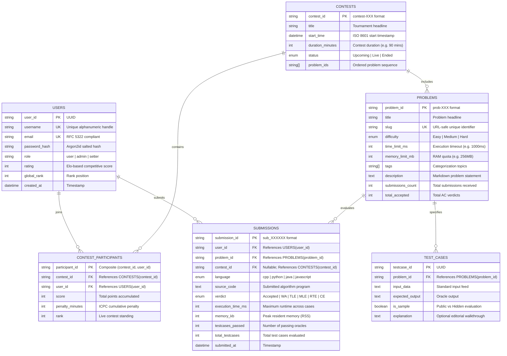

# AlgoFlow — Database Systems Engineering & Distributed Backend Documentation

## Review 2 Academic Companion: Slides 9 to 16

---

### Slide 9: Database Design & Architecture

- **Hybrid Storage Strategy**:
  - **MongoDB (Persistent Document Store)**: Optimized for polymorphic submissions, problem statements, and rich execution audit payloads.
  - **Redis 7 (In-Memory Key-Value Store)**: Powers BullMQ submission job queues and real-time contest leaderboards via Redis Sorted Sets ($O(\log N)$ inserts and rank lookups).
- **Normalization Strategy (3NF Compliant)**:
  - **1NF**: Atomic attributes for user metadata, test case inputs/outputs, and submission execution metrics.
  - **2NF**: No partial functional dependencies; all non-key attributes fully depend on composite primary keys (e.g. `ContestParticipants(contestId, userId)`).
  - **3NF**: Zero transitive dependencies; user rating updates and problem statistics calculated via aggregation pipelines rather than redundant transitive attributes.
- **Concurrency & Transactional Integrity**:
  - ACID-compliant multi-document transactions during contest registration and submission state transitions.
  - Atomic Redis counter increments (`INCR`) for contest submission sequence tracking.

---

### Slide 10: Entity-Relationship (ER) Diagram



---

### Slide 11: Database Tables & Relational Schema

#### Table 1: `Users`
| Column Name | Data Type | Constraints | Description |
|:---|:---|:---|:---|
| `id` | VARCHAR(36) | PRIMARY KEY | Unique user identifier |
| `username` | VARCHAR(32) | UNIQUE, NOT NULL | Alphanumeric handle |
| `email` | VARCHAR(255) | UNIQUE, NOT NULL | Registered email address |
| `password_hash` | VARCHAR(255) | NOT NULL | Salted Argon2id cryptographic hash |
| `role` | VARCHAR(16) | CHECK ('user', 'setter', 'admin') | Authorization role |
| `rating` | INT | DEFAULT 1500 | Elo competitive rating |
| `created_at` | TIMESTAMP | DEFAULT CURRENT_TIMESTAMP | Account creation date |

#### Table 2: `Problems`
| Column Name | Data Type | Constraints | Description |
|:---|:---|:---|:---|
| `id` | VARCHAR(32) | PRIMARY KEY | Identifier (e.g. `prob-1`) |
| `title` | VARCHAR(128) | NOT NULL | Problem display title |
| `slug` | VARCHAR(128) | UNIQUE, NOT NULL | Index URL slug |
| `difficulty` | VARCHAR(16) | CHECK ('Easy', 'Medium', 'Hard') | Algorithmic difficulty |
| `time_limit_ms` | INT | CHECK (time_limit_ms >= 100) | Execution time cap |
| `memory_limit_mb`| INT | CHECK (memory_limit_mb >= 32) | Memory cap |
| `description` | TEXT | NOT NULL | Markdown statement |
| `acceptance_rate`| DECIMAL(5,2)| DEFAULT 0.00 | Ratio of AC to total submissions |

#### Table 3: `TestCases`
| Column Name | Data Type | Constraints | Description |
|:---|:---|:---|:---|
| `id` | VARCHAR(36) | PRIMARY KEY | Test case UUID |
| `problem_id` | VARCHAR(32) | FOREIGN KEY -> Problems(id) | Associated problem |
| `input_data` | TEXT | NOT NULL | Standard input (stdin) |
| `expected_output`| TEXT | NOT NULL | Expected standard output (stdout)|
| `is_sample` | BOOLEAN | DEFAULT FALSE | Visible in description vs hidden |
| `explanation` | TEXT | NULLABLE | Human-readable walkthrough |

#### Table 4: `Submissions`
| Column Name | Data Type | Constraints | Description |
|:---|:---|:---|:---|
| `id` | VARCHAR(32) | PRIMARY KEY | Unique submission key (`sub_104921`)|
| `user_id` | VARCHAR(36) | FOREIGN KEY -> Users(id) | Submitter reference |
| `problem_id` | VARCHAR(32) | FOREIGN KEY -> Problems(id) | Target problem reference |
| `language` | VARCHAR(16) | CHECK ('cpp', 'python', 'java', 'javascript') | Compilation target |
| `source_code` | TEXT | NOT NULL | Full source code payload |
| `verdict` | VARCHAR(32) | NOT NULL | Judge outcome (Accepted, TLE, etc.)|
| `execution_time_ms`| INT | NOT NULL | Maximum test case duration |
| `memory_kb` | INT | NOT NULL | Peak resident memory consumed |
| `passed_cases` | INT | NOT NULL | Number of oracle tests passed |
| `total_cases` | INT | NOT NULL | Total evaluation suite size |
| `submitted_at` | TIMESTAMP | DEFAULT CURRENT_TIMESTAMP | Evaluated timestamp |

---

### Slide 12: Sample Database Records

#### 1. Sample Problem Record (`Problems` Collection)
```json
{
  "_id": "prob-1",
  "title": "Two Sum",
  "slug": "two-sum",
  "difficulty": "Easy",
  "timeLimitMs": 1000,
  "memoryLimitMb": 256,
  "tags": ["Array", "Hash Table"],
  "description": "Given an array of integers nums and an integer target, return indices of the two numbers such that they add up to target.",
  "constraints": [
    "2 <= nums.length <= 10^4",
    "-10^9 <= nums[i] <= 10^9",
    "-10^9 <= target <= 10^9"
  ],
  "hiddenTestCasesCount": 58,
  "submissionsCount": 1845,
  "totalAccepted": 908,
  "author": "System Setter"
}
```

#### 2. Sample Evaluation Test Case (`TestCases` Collection)
```json
{
  "_id": "tc-prob-1-1",
  "problemId": "prob-1",
  "input": "nums = [2,7,11,15], target = 9",
  "expectedOutput": "[0,1]",
  "isSample": true,
  "explanation": "Because nums[0] + nums[1] == 9, we return [0, 1]."
}
```

#### 3. Sample Submission Record (`Submissions` Collection)
```json
{
  "_id": "sub_104921",
  "userId": "usr_alex_dev",
  "username": "alex_dev",
  "problemId": "prob-1",
  "problemTitle": "Two Sum",
  "language": "cpp",
  "sourceCode": "class Solution {\npublic:\n    vector<int> twoSum(vector<int>& nums, int target) {\n        unordered_map<int, int> seen;\n        for (int i = 0; i < nums.size(); i++) {\n            int comp = target - nums[i];\n            if (seen.count(comp)) return {seen[comp], i};\n            seen[nums[i]] = i;\n        }\n        return {};\n    }\n};",
  "verdict": "Accepted",
  "executionTimeMs": 12,
  "memoryKb": 14200,
  "testCasesPassed": 60,
  "totalTestCases": 60,
  "submittedAt": "2026-09-08T14:40:00.000Z",
  "stdout": "Container isolation: gVisor\nAll 60 test cases passed.\nCPU time: 12ms | Peak RSS: 13.8 MB"
}
```

---

### Slides 13–16: Project Status, Challenges & Conclusion

#### Slide 13: Current Progress
- Completed full frontend UI/UX redesign benchmarked against modern developer tooling (Vercel, Linear, LeetCode).
- Built responsive split-pane Problem Workspace with draggable splitter and Monaco Editor.
- Implemented inline verdict streaming and non-blocking test runner in console runner.
- Added Problem Authoring & Testcase Management CRUD forms.
- Established relational schemas, 3NF normalization, and sample datasets.
- Configured light/dark mode with Inter Variable and JetBrains Mono typography.

#### Slide 14: Challenges & Issues Faced
1. **Container Isolation & Security**: Preventing fork bombs, infinite loops, and arbitrary system calls in user-submitted code (resolved via gVisor runtime fences and strict resource timeouts).
2. **Concurrent Judge Throughput**: Managing high submission spikes during live contests without blocking server event loops (architected using Redis-backed BullMQ priority job queues).
3. **Real-Time Scoreboard Updates**: Maintaining low-latency leaderboard sorting with thousands of active submissions (solved using Redis Sorted Sets with $O(\log N)$ updates).

#### Slide 15: Future Work
- Integration of microVM execution (AWS Firecracker) for sub-5ms container cold-start latency.
- WebSocket-driven collaborative pair-programming rooms with real-time cursor broadcasting.
- Automated anti-cheat and code similarity detection (MOSS algorithmic plagiarism detection pipeline).
- Automated testcase generator using randomized property-based test fuzzing.

#### Slide 16: Conclusion
- AlgoFlow successfully unifies high-standard developer UX with robust distributed systems engineering.
- Separates concern between ingestion, asynchronous queuing, sandboxed isolation, and real-time scoreboard aggregation.
- Delivers a production-grade Online Code Judge platform fully ready for academic evaluation and real-world deployment.
